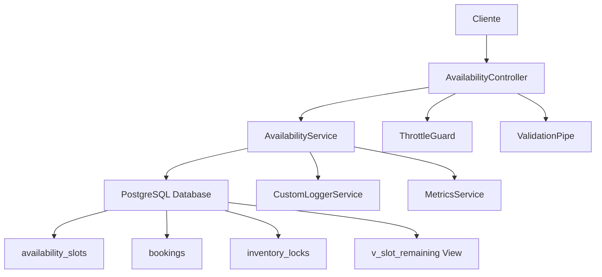
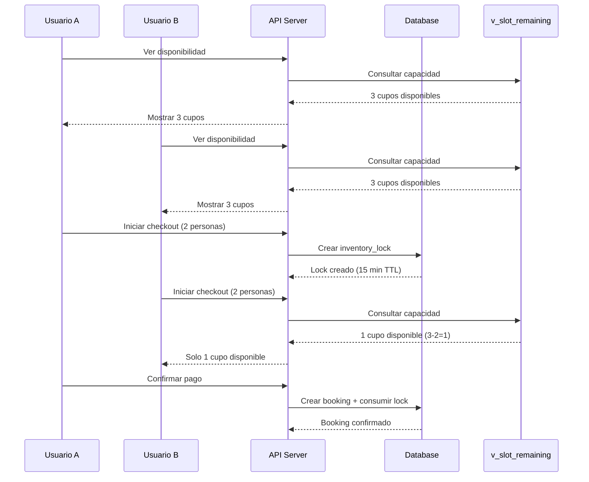

# Sistema de Disponibilidad y Motor de Reservas - LIVEX Backend

## 📋 Tabla de Contenidos

1. [Introducción](#introducción)
2. [Arquitectura del Sistema](#arquitectura-del-sistema)
3. [Estructura de Base de Datos](#estructura-de-base-de-datos)
4. [Sistema de Disponibilidad](#sistema-de-disponibilidad)
5. [Motor Anti-Sobreventa](#motor-anti-sobreventa)
6. [API Endpoints](#api-endpoints)
7. [Flujo de Reservas](#flujo-de-reservas)
8. [Casos de Uso](#casos-de-uso)
9. [Monitoreo y Métricas](#monitoreo-y-métricas)
10. [Troubleshooting](#troubleshooting)

---

## 🎯 Introducción

El **Sistema de Disponibilidad de LIVEX** es un motor robusto diseñado para gestionar la disponibilidad de experiencias turísticas con capacidades limitadas. El sistema previene la sobreventa mediante un sofisticado mecanismo de locks temporales y cálculos en tiempo real.

### Características Principales

- ✅ **Anti-sobreventa**: Prevención automática de reservas que excedan la capacidad
- ✅ **Carga masiva**: Creación eficiente de slots por rangos de fechas
- ✅ **Locks temporales**: Reserva temporal de cupos durante el proceso de checkout
- ✅ **Validaciones robustas**: Verificación de fechas, horarios y capacidades
- ✅ **Performance optimizada**: Índices y consultas optimizadas para alta concurrencia

---

## 🏗️ Arquitectura del Sistema



### Componentes Principales

| Componente | Responsabilidad |
|------------|-----------------|
| **AvailabilityController** | Endpoints REST y validación de entrada |
| **AvailabilityService** | Lógica de negocio y operaciones de base de datos |
| **Vista v_slot_remaining** | Cálculo en tiempo real de capacidad disponible |
| **CustomLoggerService** | Logging estructurado y auditoría |
| **MetricsService** | Métricas de performance y monitoreo |

---

## 🗄️ Estructura de Base de Datos

### Tabla `availability_slots`

```sql
CREATE TABLE availability_slots (
    id             uuid PRIMARY KEY DEFAULT gen_random_uuid(),
    experience_id  uuid NOT NULL REFERENCES experiences(id),
    start_time     timestamptz NOT NULL,
    end_time       timestamptz NOT NULL,
    capacity       integer NOT NULL CHECK (capacity > 0),
    created_at     timestamptz NOT NULL DEFAULT now(),
    updated_at     timestamptz NOT NULL DEFAULT now(),
    
    CONSTRAINT valid_time_range CHECK (start_time < end_time),
    CONSTRAINT no_overlapping_slots EXCLUDE USING gist (
        experience_id WITH =,
        tstzrange(start_time, end_time) WITH &&
    )
);
```

### Tabla `bookings`

```sql
CREATE TABLE bookings (
    id             uuid PRIMARY KEY DEFAULT gen_random_uuid(),
    slot_id        uuid NOT NULL REFERENCES availability_slots(id),
    user_id        uuid NOT NULL REFERENCES users(id),
    adults         integer NOT NULL DEFAULT 1,
    children       integer NOT NULL DEFAULT 0,
    status         booking_status NOT NULL DEFAULT 'pending',
    expires_at     timestamptz,
    created_at     timestamptz NOT NULL DEFAULT now(),
    updated_at     timestamptz NOT NULL DEFAULT now()
);

CREATE TYPE booking_status AS ENUM (
    'pending',      -- Reserva creada, esperando pago
    'confirmed',    -- Pago exitoso
    'expired',      -- Expiró sin pago
    'cancelled'     -- Cancelada por el usuario
);
```

### Tabla `inventory_locks`

```sql
CREATE TABLE inventory_locks (
    id             uuid PRIMARY KEY DEFAULT gen_random_uuid(),
    slot_id        uuid NOT NULL REFERENCES availability_slots(id),
    user_id        uuid,
    booking_id     uuid REFERENCES bookings(id),
    quantity       integer NOT NULL DEFAULT 1,
    expires_at     timestamptz NOT NULL,
    consumed_at    timestamptz,
    created_at     timestamptz NOT NULL DEFAULT now()
);
```

### Vista `v_slot_remaining`

```sql
CREATE VIEW v_slot_remaining AS
SELECT
    s.id AS slot_id,
    s.experience_id,
    s.capacity - COALESCE(
        -- Restar bookings confirmados/pendientes activos
        SUM(CASE 
            WHEN b.status IN ('pending','confirmed') 
            AND (b.expires_at IS NULL OR b.expires_at > now())
            THEN (b.adults + b.children) 
            ELSE 0 
        END), 0
    ) - COALESCE(
        -- Restar locks temporales no consumidos
        (SELECT SUM(l.quantity) 
         FROM inventory_locks l
         WHERE l.slot_id = s.id 
           AND l.booking_id IS NULL 
           AND l.consumed_at IS NULL 
           AND l.expires_at > now()), 0
    ) AS remaining
FROM availability_slots s
LEFT JOIN bookings b ON b.slot_id = s.id
GROUP BY s.id, s.capacity;
```

---

## 📅 Sistema de Disponibilidad

### Creación de Slots

#### 1. Slot Individual

```bash
POST /api/v1/experiences/{experienceId}/availability/slot
```

**Payload:**
```json
{
    "start_time": "2025-01-15T09:00:00.000Z",
    "end_time": "2025-01-15T12:00:00.000Z",
    "capacity": 20
}
```

#### 2. Carga Masiva

```bash
POST /api/v1/experiences/{experienceId}/availability/bulk
```

**Payload:**
```json
{
    "start_date": "2025-01-15",
    "end_date": "2025-01-25", 
    "capacity": 12,
    "slots": [
        {
            "start_hour": 9,
            "start_minute": 0,
            "end_hour": 11,
            "end_minute": 0,
            "capacity": 10,
            "days_of_week": [1, 2, 3, 4, 5]
        },
        {
            "start_hour": 14,
            "start_minute": 30,
            "end_hour": 16,
            "end_minute": 30,
            "capacity": 8,
            "days_of_week": [6, 0]
        }
    ]
}
```

### Configuración de Horarios

| Campo | Tipo | Descripción | Ejemplo |
|-------|------|-------------|---------|
| `start_hour` | `number` | Hora de inicio (0-23) | `9` = 9:00 AM |
| `start_minute` | `number` | Minuto de inicio (0-59) | `30` = :30 |
| `end_hour` | `number` | Hora de fin (0-23) | `17` = 5:00 PM |
| `end_minute` | `number` | Minuto de fin (0-59) | `0` = en punto |
| `capacity` | `number` | Capacidad específica | `15` personas |
| `days_of_week` | `array` | Días aplicables | `[1,2,3,4,5]` |

### Días de la Semana

```javascript
0 = Domingo    (Sunday)
1 = Lunes      (Monday)  
2 = Martes     (Tuesday)
3 = Miércoles  (Wednesday)
4 = Jueves     (Thursday)
5 = Viernes    (Friday)
6 = Sábado     (Saturday)
```

---

## 🔒 Motor Anti-Sobreventa

### Flujo de Prevención



### Estados de Reserva

| Estado | Descripción | Duración | Acción |
|--------|-------------|----------|---------|
| **Lock Temporal** | Cupos reservados durante checkout | 15 minutos | Se libera automáticamente |
| **Pending** | Reserva creada, esperando pago | 15 minutos | Expira si no se paga |
| **Confirmed** | Pago exitoso, cupo confirmado | Permanente | Cupo ocupado |
| **Expired** | No se pagó a tiempo | - | Cupo liberado |
| **Cancelled** | Cancelada por el usuario | - | Cupo liberado |

### Algoritmo de Cálculo

```sql
-- Capacidad disponible = Capacidad total - Reservas activas - Locks temporales
remaining = capacity - active_bookings - active_locks

WHERE:
  active_bookings = SUM(adults + children) 
    FROM bookings 
    WHERE status IN ('pending', 'confirmed')
    AND (expires_at IS NULL OR expires_at > now())

  active_locks = SUM(quantity)
    FROM inventory_locks
    WHERE booking_id IS NULL 
    AND consumed_at IS NULL 
    AND expires_at > now()
```

---

## 🔌 API Endpoints

### Consulta de Disponibilidad

```bash
GET /api/v1/experiences/{experienceId}/availability
```

**Parámetros de Query:**

| Parámetro | Tipo | Descripción | Ejemplo |
|-----------|------|-------------|---------|
| `from` | `string` | Fecha inicio (YYYY-MM-DD) | `2025-01-10` |
| `to` | `string` | Fecha fin (YYYY-MM-DD) | `2025-01-20` |
| `limit` | `number` | Máximo días (1-100) | `30` |
| `offset` | `number` | Días a saltar | `0` |
| `include_full_slots` | `boolean` | Incluir slots sin capacidad | `false` |

**Respuesta:**
```json
{
    "experience_id": "uuid",
    "availability": [
        {
            "date": "2025-01-15",
            "slots": [
                {
                    "id": "slot-uuid",
                    "experience_id": "uuid",
                    "start_time": "2025-01-15T09:00:00.000Z",
                    "end_time": "2025-01-15T12:00:00.000Z",
                    "capacity": 20,
                    "remaining": 15
                }
            ],
            "total_capacity": 20,
            "total_remaining": 15
        }
    ],
    "query_params": {
        "from": "2025-01-15",
        "to": "2025-01-20"
    },
    "total_days": 6
}
```

### Capacidad Restante

```bash
GET /api/v1/experiences/{experienceId}/availability/slots/{slotId}/remaining
```

**Respuesta:**
```json
{
    "experience_id": "uuid",
    "slot_id": "uuid", 
    "remaining": 8
}
```

### Eliminación de Slots

```bash
DELETE /api/v1/experiences/{experienceId}/availability/slots/{slotId}
```

**Validaciones:**
- ✅ Verificar que no existan bookings activos
- ✅ Confirmar permisos del usuario
- ✅ Logging de la operación

---

## 🎫 Flujo de Reservas

### 1. Consulta de Disponibilidad

```bash
# Cliente consulta disponibilidad
curl -X GET "/api/v1/experiences/tour-islas/availability?from=2025-01-15&to=2025-01-20"
```

### 2. Selección de Slot

```javascript
// Cliente selecciona slot específico
const selectedSlot = {
    id: "slot-uuid",
    start_time: "2025-01-15T09:00:00.000Z",
    end_time: "2025-01-15T12:00:00.000Z",
    remaining: 8
};
```

### 3. Inicio de Checkout

```bash
# Crear lock temporal (15 minutos)
curl -X POST "/api/v1/bookings/lock" \
-d '{
    "slot_id": "slot-uuid",
    "quantity": 2,
    "user_id": "user-uuid"
}'
```

**Respuesta:**
```json
{
    "lock_id": "lock-uuid",
    "expires_at": "2025-01-15T09:15:00.000Z",
    "quantity": 2,
    "remaining_capacity": 6
}
```

### 4. Creación de Reserva

```bash
# Crear booking pendiente
curl -X POST "/api/v1/bookings" \
-d '{
    "slot_id": "slot-uuid",
    "adults": 2,
    "children": 0,
    "lock_id": "lock-uuid"
}'
```

### 5. Procesamiento de Pago

```bash
# Confirmar pago y booking
curl -X POST "/api/v1/bookings/{bookingId}/confirm" \
-d '{
    "payment_id": "payment-uuid",
    "payment_method": "credit_card"
}'
```

### 6. Confirmación Final

```json
{
    "booking_id": "booking-uuid",
    "status": "confirmed",
    "slot": {
        "id": "slot-uuid",
        "start_time": "2025-01-15T09:00:00.000Z",
        "end_time": "2025-01-15T12:00:00.000Z"
    },
    "participants": {
        "adults": 2,
        "children": 0
    },
    "confirmation_code": "LIVEX-ABC123"
}
```

---

## 📊 Casos de Uso

### Caso 1: Tour Diario Regular

**Configuración:**
```json
{
    "start_date": "2025-02-01",
    "end_date": "2025-02-28",
    "slots": [{
        "start_hour": 10,
        "start_minute": 0,
        "end_hour": 14,
        "end_minute": 0,
        "capacity": 25,
        "days_of_week": [1,2,3,4,5,6,0]
    }]
}
```

**Resultado:** 28 slots × 25 personas = 700 cupos totales

### Caso 2: Tour de Fin de Semana

**Configuración:**
```json
{
    "start_date": "2025-03-01",
    "end_date": "2025-03-31",
    "slots": [{
        "start_hour": 8,
        "start_minute": 0,
        "end_hour": 12,
        "end_minute": 0,
        "capacity": 15,
        "days_of_week": [6,0]
    }]
}
```

**Resultado:** 8 fines de semana × 2 días × 15 personas = 240 cupos

### Caso 3: Múltiples Horarios

**Configuración:**
```json
{
    "start_date": "2025-04-01",
    "end_date": "2025-04-30",
    "slots": [
        {
            "start_hour": 9, "end_hour": 12,
            "capacity": 20,
            "days_of_week": [1,2,3,4,5]
        },
        {
            "start_hour": 14, "end_hour": 17,
            "capacity": 15,
            "days_of_week": [1,2,3,4,5]
        },
        {
            "start_hour": 10, "end_hour": 15,
            "capacity": 30,
            "days_of_week": [6,0]
        }
    ]
}
```

**Resultado:**
- Días laborales: 22 días × (20 + 15) = 770 cupos
- Fines de semana: 8 días × 30 = 240 cupos
- **Total: 1,010 cupos**

---

## 📈 Monitoreo y Métricas

### Métricas de Disponibilidad

```bash
# Prometheus metrics endpoint
GET /metrics
```

**Métricas Clave:**
```prometheus
# Consultas de disponibilidad por experiencia
livex_availability_queries_total{experience_id="uuid"} 150

# Slots creados por día
livex_slots_created_total{date="2025-01-15"} 25

# Tasa de ocupación promedio
livex_occupancy_rate{experience_id="uuid"} 0.75

# Locks temporales activos
livex_active_locks_total 12

# Tiempo promedio de respuesta
livex_availability_query_duration_seconds{quantile="0.95"} 0.045
```

### Health Checks

```bash
# Estado general del sistema
GET /health

# Preparación para recibir tráfico
GET /health/ready

# Verificación de vida
GET /health/live
```

### Logging Estructurado

```json
{
    "timestamp": "2025-01-15T10:30:00.000Z",
    "level": "info",
    "message": "Availability query completed",
    "context": {
        "requestId": "req-uuid",
        "experienceId": "exp-uuid",
        "dateRange": {
            "from": "2025-01-15",
            "to": "2025-01-20"
        },
        "slotsFound": 15,
        "totalCapacity": 300,
        "responseTime": 45
    }
}
```

---

## 🔧 Troubleshooting

### Problemas Comunes

#### 1. "No slots available"

**Causa:** Todos los slots están ocupados o no existen slots para el rango solicitado.

**Solución:**
```bash
# Verificar slots existentes
GET /api/v1/experiences/{experienceId}/availability/debug

# Crear nuevos slots si es necesario
POST /api/v1/experiences/{experienceId}/availability/bulk
```

#### 2. "Slot capacity exceeded"

**Causa:** Intento de reservar más personas de las disponibles.

**Verificación:**
```bash
# Consultar capacidad actual
GET /api/v1/experiences/{experienceId}/availability/slots/{slotId}/remaining
```

#### 3. "Lock expired"

**Causa:** El lock temporal expiró durante el checkout.

**Solución:**
```bash
# Crear nuevo lock
POST /api/v1/bookings/lock
```

### Comandos de Diagnóstico

```sql
-- Verificar slots con problemas de capacidad
SELECT s.id, s.capacity, v.remaining, 
       (s.capacity - v.remaining) as occupied
FROM availability_slots s
JOIN v_slot_remaining v ON v.slot_id = s.id
WHERE v.remaining < 0;

-- Locks temporales expirados
SELECT * FROM inventory_locks 
WHERE expires_at < now() 
AND consumed_at IS NULL;

-- Bookings pendientes por expirar
SELECT * FROM bookings 
WHERE status = 'pending' 
AND expires_at < now() + interval '5 minutes';
```

### Limpieza de Datos

```sql
-- Limpiar locks expirados
DELETE FROM inventory_locks 
WHERE expires_at < now() 
AND consumed_at IS NULL;

-- Marcar bookings expirados
UPDATE bookings 
SET status = 'expired' 
WHERE status = 'pending' 
AND expires_at < now();
```

---

## 🚀 Optimizaciones de Performance

### Índices Recomendados

```sql
-- Consultas de disponibilidad por experiencia y fecha
CREATE INDEX idx_availability_slots_experience_date 
ON availability_slots(experience_id, start_time, end_time);

-- Consultas de calendario por fecha
CREATE INDEX idx_availability_slots_date 
ON availability_slots(DATE(start_time AT TIME ZONE 'UTC'));

-- Bookings activos por slot
CREATE INDEX idx_bookings_active_slot 
ON bookings(slot_id, status) 
WHERE status IN ('pending', 'confirmed');

-- Locks temporales activos
CREATE INDEX idx_inventory_locks_active 
ON inventory_locks(slot_id, expires_at, consumed_at) 
WHERE consumed_at IS NULL;
```

### Configuración de Cache

```typescript
// Redis cache para consultas frecuentes
@Cacheable('availability', 300) // 5 minutos TTL
async getAvailability(experienceId: string, queryDto: QueryAvailabilityDto) {
    // Implementación con cache
}
```

---

## 📝 Conclusión

El Sistema de Disponibilidad de LIVEX proporciona una solución robusta y escalable para la gestión de reservas con capacidades limitadas. Su arquitectura modular, validaciones exhaustivas y mecanismos anti-sobreventa garantizan la integridad de los datos y una excelente experiencia de usuario.

### Beneficios Clave

- ✅ **Prevención de sobreventa** con locks temporales
- ✅ **Escalabilidad** para miles de slots simultáneos
- ✅ **Flexibilidad** en configuración de horarios
- ✅ **Observabilidad** completa con métricas y logs
- ✅ **Performance optimizada** con índices y cache

### Próximos Pasos

1. Implementar cache distribuido con Redis
2. Agregar notificaciones en tiempo real
3. Desarrollar dashboard de administración
4. Integrar con sistema de pagos
5. Añadir soporte para promociones y descuentos

---

*Documentación generada para LIVEX Backend v1.0.0*
*Última actualización: Enero 2025*
