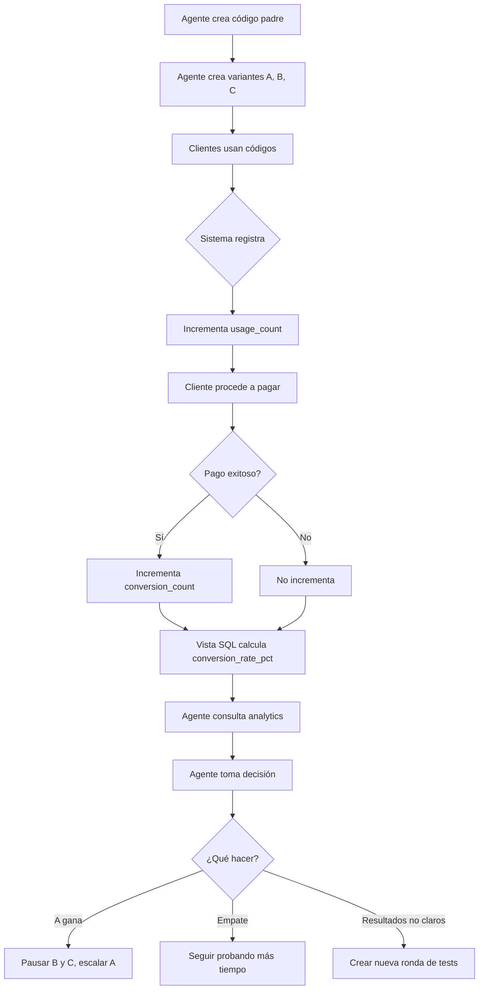

# 🧪 A/B Testing con Variantes - Guía Completa

## 📚 Índice
1. [¿Qué es el A/B Testing?](#qué-es-el-ab-testing)
2. [El Problema que Resuelve](#el-problema-que-resuelve)
3. [Cómo Funciona en LIVEX](#cómo-funciona-en-livex)
4. [Ejemplo Paso a Paso](#ejemplo-paso-a-paso)
5. [Interpretación de Resultados](#interpretación-de-resultados)
6. [Casos de Uso Reales](#casos-de-uso-reales)
7. [Mejores Prácticas](#mejores-prácticas)

---

## ¿Qué es el A/B Testing?

El **A/B Testing** (también llamado **split testing**) es un método científico para comparar dos o más versiones de algo para determinar cuál funciona mejor.

### Analogía Simple: La Tienda de Helados 🍦

Imagina que tienes una heladería y quieres saber qué precio vende más:
- **Opción A**: Vender a $5,000 COP
- **Opción B**: Vender a $3,000 COP

En lugar de adivinar, haces un experimento:
- **Lunes, Miércoles, Viernes** → precio A ($5,000)
- **Martes, Jueves, Sábado** → precio B ($3,000)

Después de 2 semanas cuentas los resultados:

| Opción | Precio | Ventas | Revenue Total |
|--------|--------|--------|---------------|
| A | $5,000 | 50 | $250,000 💰 |
| B | $3,000 | 120 | **$360,000** 🏆 |

**Conclusión basada en datos:** Aunque el precio B es más bajo, genera **44% más revenue** porque vende más del doble.

---

## El Problema que Resuelve

### Escenario Real en LIVEX

**Carlos** es un agente que promociona tours náuticos. Quiere ofrecer un código de descuento pero tiene una duda:

❓ ¿Dar **5% de descuento**?
- ✅ Mayor ganancia por venta
- ❌ Puede que no sea lo suficientemente atractivo

❓ ¿Dar **15% de descuento**?
- ✅ Muy atractivo para clientes
- ❌ Menor ganancia por venta

### El Dilema Tradicional

**Sin datos**, Carlos tendría que:
1. Adivinar basándose en "intuición"
2. Copiar lo que hace la competencia
3. Probar solo una opción y quedarse con la duda

### La Solución con A/B Testing

**Con variantes**, Carlos puede:
1. ✅ Probar ambas opciones simultáneamente
2. ✅ Medir resultados reales con datos
3. ✅ Tomar decisión informada
4. ✅ Maximizar ganancias basándose en evidencia

---

## Cómo Funciona en LIVEX

### Estructura del Sistema

```
📦 Código Padre: VERANO2025 (configuración base)
├─ 🧪 Variante A: VERANO2025A (15% descuento)
├─ 🧪 Variante B: VERANO2025B (5% descuento)
└─ 🧪 Variante C: VERANO2025C (10% descuento + comisión extra)
```

### Qué se Mide Automáticamente

| Métrica | Descripción | Cómo se Calcula |
|---------|-------------|-----------------|
| `usage_count` | Veces que se ingresó el código | Incrementa al crear booking |
| `conversion_count` | Cuántos pagaron realmente | Incrementa cuando pago = 'paid' |
| `conversion_rate_pct` | % de conversión | (conversion / usage) × 100 |

---

## Ejemplo Paso a Paso

### 1️⃣ Crear el Código Padre

Carlos crea el código base:

```bash
POST /agents/referral-codes
{
  "code": "VERANO2025",
  "codeType": "both",
  "discountType": "percentage",
  "discountValue": 1000,  // 10% (puede ser overridden por variantes)
  "description": "Promoción de Verano"
}
```

**Respuesta:**
```json
{
  "id": "550e8400-e29b-41d4-a716-446655440000",
  "code": "VERANO2025",
  ...
}
```

### 2️⃣ Crear Variante A (Agresiva)

```bash
POST /agents/referral-codes/550e8400-e29b-41d4-a716-446655440000/variants
{
  "variantName": "Variant A - 15% OFF",
  "code": "VERANO2025A",
  "discountValue": 1500  // 15%
}
```

### 3️⃣ Crear Variante B (Conservadora)

```bash
POST /agents/referral-codes/550e8400-e29b-41d4-a716-446655440000/variants
{
  "variantName": "Variant B - 5% OFF",
  "code": "VERANO2025B",
  "discountValue": 500  // 5%
}
```

### 4️⃣ Distribuir el Tráfico

Carlos comparte los códigos en diferentes canales:

| Canal | Código | Estrategia |
|-------|--------|------------|
| Instagram Stories | `VERANO2025A` | Audiencia joven, sensible a descuentos |
| Email Newsletter | `VERANO2025B` | Clientes VIP, menos sensibles al precio |
| Facebook Ads | Ambos (50/50) | Test puro |

### 5️⃣ Los Clientes Usan los Códigos

**Semana 1-2:**
```
VERANO2025A usado: 75 veces
VERANO2025B usado: 70 veces
```

**Conversiones (pagos confirmados):**
```
VERANO2025A pagados: 53 (70.7% conversión) ✅
VERANO2025B pagados: 28 (40.0% conversión)
```

### 6️⃣ Consultar Analytics

```bash
GET /agents/referral-codes/550e8400-e29b-41d4-a716-446655440000/variant-analytics
```

**Respuesta:**
```json
[
  {
    "id": "...",
    "variant_name": "Variant A - 15% OFF",
    "code": "VERANO2025A",
    "usage_count": 150,
    "conversion_count": 105,
    "conversion_rate_pct": 70.00,  // 🏆 Ganadora
    "discount_value": 1500,
    "is_active": true,
    "created_at": "2025-06-01T00:00:00Z"
  },
  {
    "id": "...",
    "variant_name": "Variant B - 5% OFF",
    "code": "VERANO2025B",
    "usage_count": 140,
    "conversion_count": 56,
    "conversion_rate_pct": 40.00,
    "discount_value": 500,
    "is_active": true,
    "created_at": "2025-06-01T00:00:00Z"
  }
]
```

---

## Interpretación de Resultados

### Análisis de la Variante A (15% OFF)

**Métricas:**
- ✅ **Tasa de Conversión:** 70%
- ⚠️ **Descuento Promedio:** $30,000 COP por venta

**Interpretación:**
- El descuento es lo suficientemente atractivo
- 7 de cada 10 personas que lo ven, compran
- Mayor "fricción" removida del proceso de compra

**Revenue Estimado:**
```
105 ventas × $200,000 COP (ticket promedio) = $21,000,000 COP
Descuentos dados: 105 × $30,000 = -$3,150,000 COP
Revenue Neto: $17,850,000 COP 🏆
```

### Análisis de la Variante B (5% OFF)

**Métricas:**
- ⚠️ **Tasa de Conversión:** 40%
- ✅ **Descuento Promedio:** $10,000 COP por venta

**Interpretación:**
- El descuento es percibido como "poco atractivo"
- Solo 4 de cada 10 convierten
- Muchos abandonan por precio

**Revenue Estimado:**
```
56 ventas × $200,000 COP = $11,200,000 COP
Descuentos dados: 56 × $10,000 = -$560,000 COP
Revenue Neto: $10,640,000 COP
```

### La Decisión Final

| Métrica | Variante A | Variante B | Diferencia |
|---------|-----------|-----------|------------|
| Conversión | 70% | 40% | **+75%** |
| Revenue Neto | $17.85M | $10.64M | **+68%** |
| Ganancia por Venta | $170,000 | $190,000 | -10% |

**Ganador Claro: Variante A** 🎉

A pesar de dar más descuento por venta individual, **genera 68% más revenue total** debido a la conversión superior.

**Acción de Carlos:**
1. ✅ Pausar Variante B
2. ✅ Escalar Variante A (más presupuesto de marketing)
3. ✅ Usar `VERANO2025A` como estándar

---

## Casos de Uso Reales

### Caso 1: Test de Precio Psicológico

**Hipótesis:** ¿Un descuento mayor siempre es mejor?

```
Control: 10% OFF
Variante A: 15% OFF
Variante B: 20% OFF
Variante C: 25% OFF
```

**Resultado Típico:**
```
10% → 45% conversión
15% → 70% conversión ✅ Sweet spot
20% → 72% conversión (marginal)
25% → 73% conversión (canibalización)
```

**Insight:** A partir del 15%, el ROI decrece. Más descuento ≠ Más ganancias.

---

### Caso 2: Test de Mensajes de Marketing

**Pregunta:** ¿Qué mensaje conecta mejor?

```
Variante A: "15% OFF - Oferta Limitada"
Variante B: "Ahorra $30,000 COP Hoy"
Variante C: "GRATIS: Snorkel + 15% Descuento"
```

**Métricas a Comparar:**
- Click-through rate (CTR)
- Tiempo en página
- Conversión final

---

### Caso 3: Test de Canales de Adquisición

**Pregunta:** ¿De dónde vienen los mejores clientes?

```
Variante A: Instagram (@influencer_travel)
Variante B: Email Marketing (base de datos)
Variante C: Google Ads (búsqueda pagada)
```

**Métricas Clave:**
- **CAC** (Costo de Adquisición por Cliente)
- **LTV** (Lifetime Value)
- **ROI** por canal

---

### Caso 4: Test de Comisión para Agentes

**Pregunta:** ¿Qué balance incentiva más a agentes?

```
Variante A: 15% descuento cliente + 5% comisión agente
Variante B: 10% descuento cliente + 7% comisión agente
Variante C: 20% descuento cliente + 3% comisión agente
```

---

## Mejores Prácticas

### ✅ DO - Buenas Prácticas

#### 1. **Tamaño de Muestra Suficiente**
```
Mínimo: 100 usos por variante
Ideal: 500+ usos por variante
```
Con pocas muestras, los resultados pueden ser aleatorios.

#### 2. **Tiempo de Test Adecuado**
```
Mínimo: 1 semana
Ideal: 2-4 semanas
```
Permite capturar variaciones de comportamiento (fin de semana vs días laborales).

#### 3. **Cambiar Solo Una Variable**
```
❌ Malo: Cambiar precio Y mensaje Y canal
✅ Bueno: Cambiar solo el precio
```

#### 4. **Documentar Hipótesis**
```markdown
Hipótesis: Un descuento del 15% aumentará la conversión en 50%
Métrica de Éxito: Conversion rate > 60%
Duración: 2 semanas
```

---

### ❌ DON'T - Errores Comunes

#### 1. **Detener Test Demasiado Pronto**
```
❌ "Después de 2 días, A va ganando, la escalo ya"
✅ Esperar al menos 1 semana completa
```

#### 2. **Ignorar Significancia Estadística**
```
❌ Variante A: 51% vs Variante B: 49% → "A gana!"
✅ La diferencia es insignificante, seguir probando
```

#### 3. **No Considerar Estacionalidad**
```
❌ Hacer test en Black Friday (comportamiento anormal)
✅ Hacer test en semanas regulares
```

#### 4. **Cambiar Variantes a Mitad de Test**
```
❌ "Esto no está funcionando, cambio el descuento"
✅ Dejar correr el test completo
```

---

## Flujo Técnico Completo



---

## Métricas de Éxito por Industria

### Benchmarks de Conversión

| Industria | Conversion Rate Promedio |
|-----------|--------------------------|
| E-commerce | 2-3% |
| SaaS | 5-10% |
| Turismo/Experiencias | **15-25%** ⬅️ LIVEX |
| Servicios Premium | 1-2% |

**Nota:** En turismo, las conversiones son más altas porque:
- Compra emocional (vacaciones)
- Decisión más rápida
- Precio percibido como "inversión en experiencia"

---

## Estadísticas Reales de la Industria

Datos de estudios de marketing:

| Descuento | CTR | Conversión | Revenue Index |
|-----------|-----|------------|---------------|
| 0% | 2% | 1% | 100 |
| 5% | 4% | 2.5% | 240 |
| 10% | 8% | 5% | **480** 🏆 |
| 15% | 10% | 6% | 440 |
| 20%+ | 12% | 6.5% | 360 ⚠️ |

**Insight Clave:** El "sweet spot" suele estar entre **10-15%** de descuento para productos de experiencias.

---

## Conclusión

### A/B Testing es...

**🔬 Ciencia, no Adivinanza**
- Decisiones basadas en datos reales
- Elimina el sesgo personal
- Prueba hipótesis con método científico

**💰 Maximización de Revenue**
- Encuentra el balance óptimo precio-conversión
- Reduce costos de adquisición
- Incrementa lifetime value

**🎯 Optimización Continua**
- No es un "set and forget"
- Siempre hay algo que mejorar
- La competencia evoluciona, tú también

---

## Recursos Adicionales

### Para Agentes
- 📊 Dashboard de Analytics: `/agents/analytics`
- 🧪 Crear variantes: `/agents/referral-codes/:id/variants`
- 📈 Ver rendimiento: `/agents/referral-codes/:id/variant-analytics`

### Documentación Relacionada
- [Sistema de Códigos de Referido v2.0](./REFERRAL_CODES_SYSTEM.md)
- [Guía de CURL Tests](./AGENTS_CURL_TESTS.md)
- [Resumen Ejecutivo v2.0](./AGENTS_V2_SUMMARY.md)

---

**Última actualización:** 2025-11-25  
**Versión:** 1.0  
**Autor:** Sistema de Agentes LIVEX
