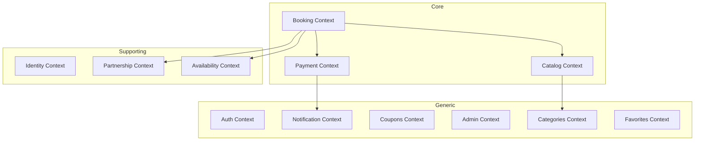
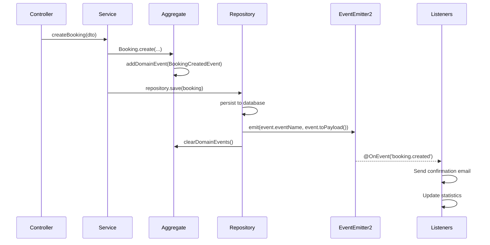

# Domain-Driven Design Architecture - Livex Backend

## Table of Contents
- [Overview](#overview)
- [Bounded Contexts](#bounded-contexts)
- [Architecture Layers](#architecture-layers)
- [Domain Events & Event Bus](#domain-events--event-bus)
- [Component Summary](#component-summary)

---

## Overview

This backend follows **Domain-Driven Design (DDD)** principles to encapsulate business logic within the domain layer, ensuring a clean separation of concerns.

```
┌─────────────────────────────────────────────────────────────────┐
│                      Application Layer                          │
│                   (Controllers, DTOs, Guards)                   │
├─────────────────────────────────────────────────────────────────┤
│                       Domain Layer                              │
│  ┌─────────────┐  ┌─────────────┐  ┌─────────────────────────┐ │
│  │ Aggregates  │  │   Value     │  │   Domain Policies       │ │
│  │ & Entities  │  │  Objects    │  │   & Business Rules      │ │
│  └─────────────┘  └─────────────┘  └─────────────────────────┘ │
│  ┌─────────────────────────────────────────────────────────┐   │
│  │              Domain Events                              │   │
│  └─────────────────────────────────────────────────────────┘   │
├─────────────────────────────────────────────────────────────────┤
│                   Infrastructure Layer                          │
│  ┌─────────────┐  ┌─────────────┐  ┌─────────────────────────┐ │
│  │Repositories │  │   Mappers   │  │   Event Publisher       │ │
│  │(PostgreSQL) │  │             │  │   (EventEmitter2)       │ │
│  └─────────────┘  └─────────────┘  └─────────────────────────┘ │
└─────────────────────────────────────────────────────────────────┘
```

---

## Bounded Contexts



| Context | Purpose | Key Aggregates |
|---------|---------|----------------|
| **Booking** | Reservation management | `Booking` |
| **Payment** | Payment processing | `Payment` |
| **Catalog** | Experience & Resort management | `Experience`, `Resort` |
| **Identity** | User management | `User` |
| **Partnership** | Agent & referral management | `Agent` |
| **Availability** | Slot scheduling | `AvailabilitySlot` |
| **Auth** | Authentication tokens | `RefreshToken`, `PasswordResetToken` |
| **Coupons** | Discount management | `Coupon`, `VipSubscription` |
| **Notification** | Email notifications | `Notification` |
| **Categories** | Experience categories | `Category` |
| **Favorites** | User favorites | `Favorite` |
| **Admin** | Dashboard & statistics | Read models |

---

## Architecture Layers

### Domain Layer (`/modules/{context}/domain/`)

```
domain/
├── aggregates/       # Aggregate roots with business logic
├── entities/         # Child entities
├── value-objects/    # Immutable value types
├── events/           # Domain events
├── policies/         # Business rules
├── repositories/     # Repository interfaces (ports)
└── index.ts          # Barrel export
```

### Infrastructure Layer (`/modules/{context}/infrastructure/`)

```
infrastructure/
├── persistence/
│   ├── {entity}.repository.ts  # Repository implementation
│   └── {entity}.mapper.ts      # Domain ↔ DB mapping
└── index.ts
```

---

## Domain Events & Event Bus

### What is the Event Bus?

The **Event Bus** (`EventEmitter2` from `@nestjs/event-emitter`) enables **loose coupling** between bounded contexts. When something important happens in the domain, an event is published that other parts of the system can react to without direct dependencies.

### Event Flow



### Example: Booking Confirmation Flow

```typescript
// 1. Aggregate creates event
class Booking extends AggregateRoot<BookingProps> {
    confirm(): void {
        this.props.status = BookingStatus.confirmed();
        this.addDomainEvent(new BookingConfirmedEvent({
            bookingId: this.id,
            bookingCode: this.code,
            userId: this.userId,
        }));
    }
}

// 2. Repository persists and publishes
class BookingRepository {
    async save(booking: Booking): Promise<void> {
        await this.db.query(...); // Persist
        
        for (const event of booking.domainEvents) {
            this.eventEmitter.emit(event.eventName, event.toPayload());
        }
        booking.clearDomainEvents();
    }
}

// 3. Listener reacts
@Injectable()
class NotificationListener {
    @OnEvent('booking.confirmed')
    async handleBookingConfirmed(payload: BookingConfirmedPayload) {
        await this.notificationService.sendBookingConfirmation(...);
    }
}
```

### Benefits

| Benefit | Description |
|---------|-------------|
| **Loose Coupling** | Contexts don't depend on each other directly |
| **Single Responsibility** | Each listener handles one concern |
| **Extensibility** | Add new reactions without modifying core logic |
| **Auditability** | Events can be logged for debugging |

---

## Component Summary

| Component | Count |
|-----------|-------|
| Bounded Contexts | 12 |
| Value Objects | ~45 |
| Entities/Aggregates | ~18 |
| Domain Policies | 14 |
| Repository Interfaces | ~20 |
| Repositories with Events | 8 |
| Domain Events | ~15 |

### Domain Policies

| Context | Policy | Rules |
|---------|--------|-------|
| Booking | `BookingExpiryPolicy` | 15m TTL for pending bookings |
| Booking | `CommissionPolicy` | Platform + agent fee calculation |
| Booking | `CheckInPolicy` | 2h window, authorization |
| Payment | `RefundPolicy` | 48h window, amount validation |
| Coupons | `CouponValidationPolicy` | Dates, uses, minimum |
| Coupons | `DiscountStackingPolicy` | Combination rules |
| Coupons | `VipActivationPolicy` | Eligibility, duration |
| Auth | `PasswordPolicy` | Strength requirements |
| Auth | `TokenRotationPolicy` | JWT rotation rules |
| Partnership | `ReferralCodeValidator` | Format, restrictions |
| Availability | `SlotValidationPolicy` | Date/time ranges |
| Availability | `SlotCapacityPolicy` | Capacity calculation |
| Shared | `CurrencyConversionPolicy` | Currency conversion |

---

## Directory Structure

```
src/
├── modules/
│   ├── booking/
│   │   ├── domain/
│   │   │   ├── aggregates/
│   │   │   ├── value-objects/
│   │   │   ├── events/
│   │   │   ├── policies/
│   │   │   └── repositories/
│   │   └── infrastructure/
│   │       └── persistence/
│   ├── payment/
│   ├── catalog/
│   ├── identity/
│   ├── partnership/
│   ├── availability/
│   ├── auth/
│   ├── coupons/
│   ├── notification/
│   ├── categories/
│   ├── favorites/
│   └── admin/
└── shared/
    ├── domain/
    │   ├── base/           # Entity, AggregateRoot, ValueObject, DomainEvent
    │   ├── value-objects/  # Money, Currency, ExchangeRate
    │   ├── interfaces/     # Pagination
    │   └── policies/       # CurrencyConversionPolicy
    └── infrastructure/
        └── domain-event-publisher.ts
```
