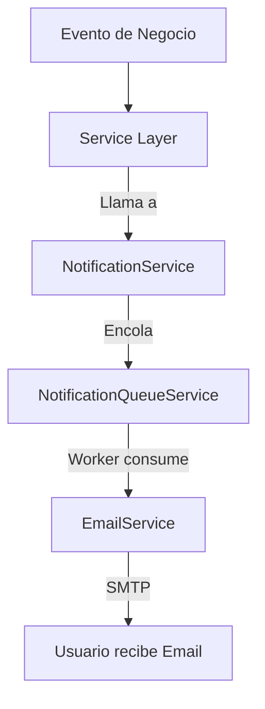

# 📧 Sistema de Notificaciones - LIVEX

## 📋 Índice
1. [Visión General](#visión-general)
2. [Arquitectura](#arquitectura)
3. [Tipos de Notificaciones](#tipos-de-notificaciones)
4. [Integración Implementada](#integración-implementada)
5. [Configuración](#configuración)
6. [Plantillas de Email](#plantillas-de-email)
7. [Testing](#testing)
8. [Troubleshooting](#troubleshooting)

---

## Visión General

El sistema de notificaciones de LIVEX está diseñado para enviar comunicaciones automáticas a los usuarios en momentos clave del flujo de la aplicación:

- ✅ **Confirmaciones de Reserva**
- ✅ **Pagos Exitosos**
- ✅ **Reembolsos Procesados**
- ✅ **Bienvenida a Nuevos Usuarios**
- ✅ **Recuperación de Contraseña**
- 🔄 **Recordatorios de Experiencias** (Programado)
- 📊 **Notificaciones para Resorts** (Aprobaciones/Rechazos)

---

## Arquitectura

### Componentes Principales

```
┌─────────────────────────────────────────────────────┐
│            Services que Envían Notificaciones       │
├─────────────────────────────────────────────────────┤
│  • BookingsService                                  │
│  • AuthService                                      │
│  • PaymentsService                                  │
└───────────────┬─────────────────────────────────────┘
                │
                ▼
┌─────────────────────────────────────────────────────┐
│            NotificationService                      │
│  (Orquestador central de notificaciones)           │
├─────────────────────────────────────────────────────┤
│  • sendBookingConfirmation()                        │
│  • sendPaymentConfirmation()                        │
│  • sendWelcomeEmail()                               │
│  • sendPasswordReset()                              │
│  • sendRefundProcessed()                            │
└───────────────┬─────────────────────────────────────┘
                │
                ├──────────────┬──────────────────────┐
                ▼              ▼                      ▼
┌───────────────────┐  ┌─────────────────┐  ┌─────────────────┐
│ EmailService      │  │ NotificationQueue│  │ SMS Service     │
│ (SMTP/Nodemailer) │  │ Service (Redis)  │  │ (Futuro)        │
└───────────────────┘  └─────────────────┘  └─────────────────┘
```

### Flujo de Envío



---

## Tipos de Notificaciones

### 1. **Confirmación de Reserva** ✅
**Trigger:** Cuando una reserva pasa de `pending` a `confirmed`  
**Servicio:** `BookingsService.confirmPendingBooking()`

**Datos enviados:**
```typescript
{
  customerName: string,
  experienceName: string,
  bookingDate: string,
  bookingTime: string,
  guestCount: number,
  totalAmount: number,
  bookingCode: string
}
```

**Implementación:**
```typescript
// src/bookings/bookings.service.ts
this.notificationService.sendBookingConfirmation(
  details.email,
  {
    customerName: details.full_name,
    experienceName: details.experience_title,
    bookingDate: new Date(details.start_time).toLocaleDateString(),
    bookingTime: new Date(details.start_time).toLocaleTimeString(),
    guestCount: details.adults + details.children,
    totalAmount: Number((details.total_cents / 100).toFixed(2)),
    bookingCode: details.id.substring(0, 8).toUpperCase(),
  }
);
```

---

### 2. **Bienvenida** 👋
**Trigger:** Al registrar un nuevo usuario  
**Servicio:** `AuthService.register()`

**Datos enviados:**
```typescript
{
  userName: string
}
```

**Implementación:**
```typescript
// src/auth/auth.service.ts
this.notificationService.sendWelcomeEmail(user.email, {
  userName: user.fullName || 'Usuario',
});
```

---

### 3. **Recuperación de Contraseña** 🔑
**Trigger:** Cuando un usuario solicita reset de contraseña  
**Servicio:** `AuthService.requestPasswordReset()`

**Datos enviados:**
```typescript
{
  userName: string,
  resetLink: string  // URL con token único
}
```

**Implementación:**
```typescript
// src/auth/auth.service.ts
const resetLink = `${this.configService.get('FRONTEND_URL')}/reset-password?token=${token}`;

this.notificationService.sendPasswordReset(user.email, {
  userName: user.fullName || 'Usuario',
  resetLink,
});
```

---

### 4. **Pago Confirmado** 💳
**Trigger:** Cuando un pago se marca como `paid`  
**Servicio:** `PaymentsService.confirmBookingPayment()`

**Datos enviados:**
```typescript
{
  customerName: string,
  amount: number,
  bookingCode: string
}
```

**Implementación:**
```typescript
// src/payments/payments.service.ts (método privado)
this.notificationService.sendPaymentConfirmation(user.email, {
  customerName: user.full_name,
  amount: Number((user.total_cents / 100).toFixed(2)),
  bookingCode: bookingId.substring(0, 8).toUpperCase(),
});
```

---

### 5. **Reembolso Procesado** 💰
**Trigger:** Cuando se crea un refund  
**Servicio:** `PaymentsService.createRefund()`

**Datos enviados:**
```typescript
{
  customerName: string,
  refundAmount: number,
  bookingCode: string
}
```

**Implementación:**
```typescript
// src/payments/payments.service.ts
this.notificationService.sendRefundProcessed(user.email, {
  customerName: user.full_name,
  refundAmount: Number((refundAmount / 100).toFixed(2)),
  bookingCode: user.booking_id.substring(0, 8).toUpperCase(),
});
```

---

## Integración Implementada

### Servicios Conectados

| Servicio | Notificaciones Enviadas | Estado |
|----------|------------------------|--------|
| **BookingsService** | Confirmación de Reserva | ✅ Implementado |
| **AuthService** | Bienvenida, Reset Password | ✅ Implementado |
| **PaymentsService** | Pago Confirmado, Reembolso | ✅ Implementado |
| **AdminService** | Aprobaciones de Resort/Experiencia | 🔄 Pendiente |

### Inyección de Dependencias

Todos los servicios inyectan `NotificationService`:

```typescript
// Ejemplo: BookingsService
constructor(
  @Inject(DATABASE_CLIENT) private readonly db: DatabaseClient,
  private readonly logger: CustomLoggerService,
  private readonly configService: ConfigService,
  private readonly notificationService: NotificationService, // ✅ Inyectado
) {}
```

---

## Configuración

### Variables de Entorno

```bash
# SMTP Configuration (Desarrollo)
SMTP_HOST=localhost
SMTP_PORT=1025
SMTP_SECURE=false
SMTP_FROM=noreply@livex.com

# SMTP Configuration (Producción)
SMTP_HOST=smtp.gmail.com
SMTP_PORT=587
SMTP_SECURE=true
SMTP_USER=your-email@gmail.com
SMTP_PASS=your-app-password
SMTP_FROM=noreply@livex.com

# Frontend URL (para links en emails)
FRONTEND_URL=https://livex.com
```

### Desarrollo Local con Mailhog

Para testing local, se recomienda usar **Mailhog** para capturar emails sin enviarlos realmente:

```bash
# Instalar Mailhog (macOS)
brew install mailhog

# Correr Mailhog
mailhog

# Acceder a la interfaz web
http://localhost:8025
```

Configurar `.env`:
```bash
SMTP_HOST=localhost
SMTP_PORT=1025
```

---

## Plantillas de Email

Las plantillas están definidas en:
- **Código:** `src/notifications/services/email.service.ts` (plantillas inline)
- **Archivos:** `src/notifications/templates/*.hbs` (Handlebars, opcional)

### Estructura de una Plantilla

```typescript
{
  subject: '✅ Confirmación de Reserva - LIVEX',
  html: `
    <h2>¡Tu reserva ha sido confirmada!</h2>
    <p>Hola {{customerName}},</p>
    <p>Tu reserva para <strong>{{experienceName}}</strong> ha sido confirmada.</p>
    <ul>
      <li><strong>Fecha:</strong> {{bookingDate}}</li>
      <li><strong>Hora:</strong> {{bookingTime}}</li>
      <li><strong>Personas:</strong> {{guestCount}}</li>
      <li><strong>Total:</strong> ${{totalAmount}}</li>
    </ul>
    <p>Código de reserva: <strong>{{bookingCode}}</strong></p>
  `,
  text: 'Tu reserva para {{experienceName}} ha sido confirmada. Código: {{bookingCode}}'
}
```

### Personalización con Handlebars

Para mayor flexibilidad, puedes crear archivos `.hbs`:

```handlebars
<!-- src/notifications/templates/booking_confirmation_es.hbs -->
<!DOCTYPE html>
<html>
<head>
  <style>
    body { font-family: Arial, sans-serif; }
    .header { background: #4CAF50; color: white; padding: 20px; }
    .content { padding: 20px; }
  </style>
</head>
<body>
  <div class="header">
    <h1>¡Reserva Confirmada!</h1>
  </div>
  <div class="content">
    <p>Hola {{customerName}},</p>
    <p>Tu experiencia <strong>{{experienceName}}</strong> está confirmada para el {{bookingDate}} a las {{bookingTime}}.</p>
    <p>Código de reserva: <strong>{{bookingCode}}</strong></p>
  </div>
</body>
</html>
```

---

## Testing

### Endpoint de Test

`NotificationService` incluye un método para enviar emails de prueba:

```bash
# Llamar desde un endpoint (agregar en NotificationController)
GET /api/v1/notifications/test?email=test@example.com&type=booking_confirmation
```

### Test Manual

```typescript
// En cualquier método de prueba
await this.notificationService.sendTestEmail(
  'tu-email@gmail.com',
  EmailTemplateType.BOOKING_CONFIRMATION
);
```

### Verificación de Entrega

#### Desarrollo (Mailhog)
1. Abrir `http://localhost:8025`
2. Verificar que el email aparece en la bandeja

#### Producción
1. Revisar logs de `EmailService`
2. Verificar con el proveedor SMTP (Gmail, SendGrid, etc.)

---

## Troubleshooting

### ❌ Los emails no se envían

**Síntomas:** No hay errores pero los emails no llegan.

**Soluciones:**
1. Verificar configuración SMTP en `.env`
2. Revisar logs de `EmailService`:
   ```
   [EmailService] Email sent successfully to user@example.com
   ```
3. Si usas Gmail:
   - Habilitar "App Passwords" en cuenta de Google
   - Permitir "Less secure apps" (no recomendado)
   - Usar OAuth2 (recomendado para producción)

### ❌ Error: "SMTP connection failed"

**Causa:** Configuración SMTP incorrecta o firewall bloqueando puerto.

**Solución:**
```bash
# Test manual de conexión SMTP
telnet smtp.gmail.com 587

# Si no conecta, verificar firewall
sudo ufw allow 587
```

### ❌ Error: "Template not found"

**Causa:** Plantilla Handlebars no cargada.

**Solución:**
1. Verificar que el archivo `.hbs` existe en `src/notifications/templates/`
2. Reiniciar el servidor para recargar plantillas

### ⚠️ Emails van a Spam

**Causa:** Falta de SPF/DKIM/DMARC configurados en el dominio.

**Solución:**
1. Configurar registros DNS:
   ```
   v=spf1 include:_spf.google.com ~all
   ```
2. Usar un servicio profesional (SendGrid, Mailgun, Amazon SES)
3. Incluir "unsubscribe" link en emails masivos

---

## Mejores Prácticas

### ✅ DO

1. **Usar colas asíncronas** para envíos masivos
2. **Incluir plaintext** además de HTML
3. **Personalizar remitente** (`SMTP_FROM`)
4. **Logs detallados** de éxitos/fallos
5. **Rate limiting** para evitar spam

### ❌ DON'T

1. **No bloquear** la transacción principal con envío de email
2. **No enviar emails sensibles** sin cifrado (usar TLS)
3. **No hardcodear** URLs en templates (usar `FRONTEND_URL`)
4. **No ignorar errores** de envío (loguear todo)

---

## Roadmap Futuro

### 🔄 En Progreso
- [ ] Recordatorios automáticos 24h antes de la experiencia
- [ ] Notificaciones de cancelación (cliente/resort)

### 📅 Planificado
- [ ] SMS notifications con Twilio
- [ ] Push notifications (PWA)
- [ ] Emails transaccionales con SendGrid
- [ ] A/B testing de templates
- [ ] Dashboard de métricas de entrega

### 💡 Ideas
- [ ] Preferencias de usuario (opt-in/opt-out)
- [ ] Multi-idioma automático basado en locale
- [ ] Notificaciones in-app (WebSockets)

---

## Referencias

- **EmailService:** `src/notifications/services/email.service.ts`
- **NotificationService:** `src/notifications/services/notification.service.ts`
- **Templates:** `src/notifications/templates/`
- **Interfaces:** `src/notifications/interfaces/email-template.interface.ts`

---

**Versión:** 1.0  
**Última actualización:** 2025-11-26  
**Estado:** ✅ Producción-Ready
