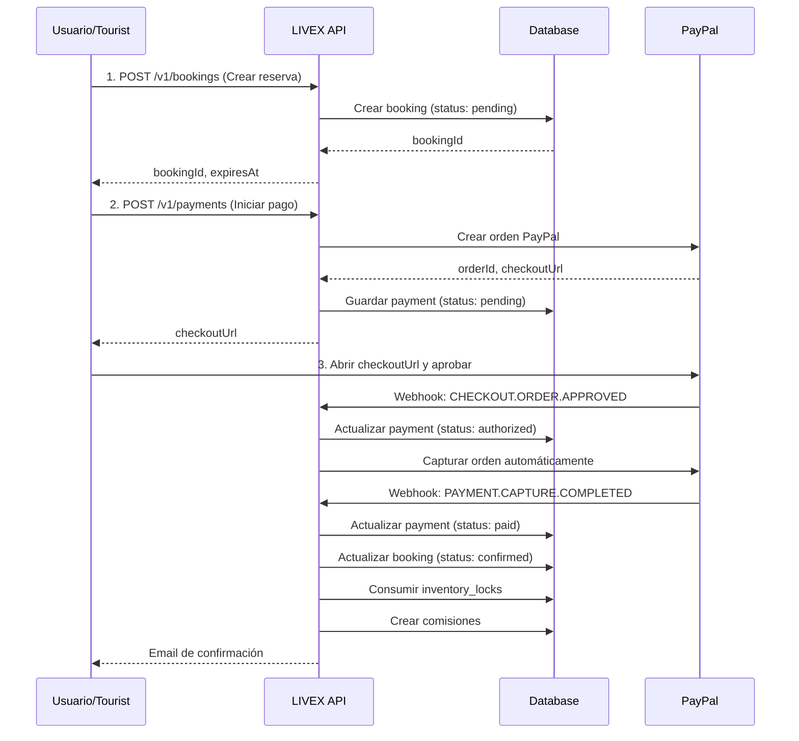
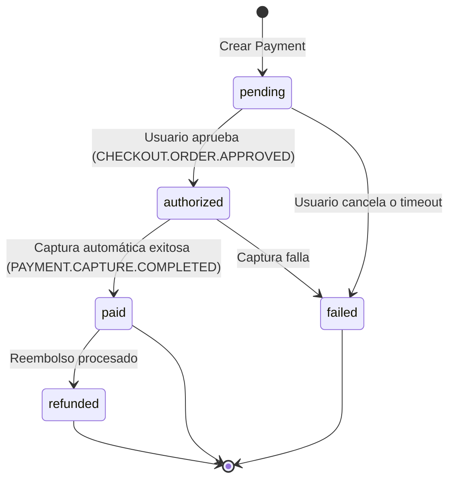

# Guía de Integración de Pagos con PayPal

Esta guía documenta el flujo completo para procesar pagos con PayPal en el backend de LIVEX.

## 📋 Tabla de Contenidos

1. [Flujo Completo](#flujo-completo)
2. [Configuración Inicial](#configuración-inicial)
3. [Crear una Reserva (Booking)](#1-crear-una-reserva-booking)
4. [Crear un Pago con PayPal](#2-crear-un-pago-con-paypal)
5. [Aprobar el Pago (Usuario)](#3-aprobar-el-pago-usuario)
6. [Verificar Estado del Pago](#4-verificar-estado-del-pago)
7. [Webhooks y Captura Automática](#5-webhooks-y-captura-automática)
8. [Testing en Sandbox](#testing-en-sandbox)
9. [Errores Comunes](#errores-comunes)

---

## Flujo Completo



---

## Configuración Inicial

### Variables de Entorno

En `.env.development`:

```env
# PayPal Sandbox
PAYPAL_CLIENT_ID=your_sandbox_client_id
PAYPAL_CLIENT_SECRET=your_sandbox_client_secret
PAYPAL_WEBHOOK_ID=your_webhook_id_from_dashboard
```

### Obtener Credenciales

1. Ir a [developer.paypal.com](https://developer.paypal.com)
2. Crear una app en **Sandbox** → **Apps & Credentials**
3. Copiar `Client ID` y `Client Secret`
4. Configurar webhooks (ver sección de [Webhooks](#5-webhooks-y-captura-automática)) -- debe ser la url de la api de livex o en prueba con ngrok alguna url que tenga certificado ssl

usuario de prueba: 

email: sb-fwzds43999531@personal.example.com
password: |vKO3l.<

---

## 1. Crear una Reserva (Booking)

Antes de crear un pago, necesitas una reserva en estado `pending`.

### Endpoint

```http
POST /api/v1/bookings
Authorization: Bearer {JWT_TOKEN}
Content-Type: application/json
```

### Request Body

```json
{
  "slotId": "uuid-del-slot-disponible",
  "experienceId": "uuid-de-la-experiencia",
  "adults": 2,
  "children": 1,
  "subtotalCents": 200000,
  "taxCents": 9500,
  "currency": "USD"
}
```

> **⚠️ Importante:** PayPal Sandbox funciona mejor con `USD`. Si usas `COP`, asegúrate de que tu cuenta de Sandbox lo soporte.

### Response

```json
{
  "bookingId": "89be723a-0185-4c30-b463-e0921b1206dc",
  "lockId": "lock-uuid",
  "status": "pending",
  "expiresAt": "2025-12-04T04:08:23.008Z",
  "totalCents": 209500,
  "currency": "USD"
}
```

---

## 2. Crear un Pago con PayPal

Una vez tengas el `bookingId`, creas el pago.

### Endpoint

```http
POST /api/v1/payments
Authorization: Bearer {JWT_TOKEN}
Content-Type: application/json
```

### Request Body

```json
{
  "bookingId": "89be723a-0185-4c30-b463-e0921b1206dc",
  "provider": "paypal",
  "paymentMethod": "paypal_account"
}
```

### Response

```json
{
  "id": "c1ac7699-9874-487d-932c-ac78bc41407a",
  "bookingId": "89be723a-0185-4c30-b463-e0921b1206dc",
  "provider": "paypal",
  "amount": 209500,
  "currency": "USD",
  "status": "pending",
  "checkoutUrl": "https://www.sandbox.paypal.com/checkoutnow?token=1A2317013G4025029",
  "expiresAt": "2025-12-04T03:53:23.008Z",
  "createdAt": "2025-12-04T03:38:22.967Z"
}
```

---

## 3. Aprobar el Pago (Usuario)

El usuario debe abrir la `checkoutUrl` en su navegador.

1. **Frontend:** Redirigir al usuario a `checkoutUrl`
2. **Usuario:** Inicia sesión en PayPal Sandbox
   - Email: `sb-buyer@business.example.com` (cuenta de prueba creada en Sandbox)
   - Password: Tu contraseña de Sandbox
3. **Usuario:** Hace clic en **"Pay Now"**

PayPal redirigirá a:
- **Éxito:** `{FRONTEND_URL}/payment/success`
- **Cancelación:** `{FRONTEND_URL}/payment/cancel`

---

## 4. Verificar Estado del Pago

Después de que el usuario apruebe, puedes consultar el estado.

### Endpoint

```http
GET /api/v1/payments/{paymentId}
Authorization: Bearer {JWT_TOKEN}
```

### Response (antes de capturar)

```json
{
  "id": "c1ac7699-9874-487d-932c-ac78bc41407a",
  "bookingId": "89be723a-0185-4c30-b463-e0921b1206dc",
  "provider": "paypal",
  "status": "authorized",
  "authorizedAt": "2025-12-04T04:00:00.000Z",
  ...
}
```

### Response (después de capturar)

```json
{
  "id": "c1ac7699-9874-487d-932c-ac78bc41407a",
  "bookingId": "89be723a-0185-4c30-b463-e0921b1206dc",
  "provider": "paypal",
  "status": "paid",
  "authorizedAt": "2025-12-04T04:00:00.000Z",
  "paidAt": "2025-12-04T04:00:05.000Z",
  ...
}
```

### Verificar Estado del Booking

```http
GET /api/v1/bookings/{bookingId}
Authorization: Bearer {JWT_TOKEN}
```

```json
{
  "id": "89be723a-0185-4c30-b463-e0921b1206dc",
  "status": "confirmed",
  ...
}
```

---

## 5. Webhooks y Captura Automática

PayPal envía webhooks a tu servidor para notificar eventos de pago.

### Configurar Webhooks en PayPal

1. Ir a [developer.paypal.com](https://developer.paypal.com)
2. **Apps & Credentials** → Tu App → **Webhooks**
3. **Add Webhook**
   - **URL:** `https://tu-dominio.com/api/v1/payments/webhooks/paypal`
   - **Events:** Seleccionar:
     - `CHECKOUT.ORDER.APPROVED`
     - `PAYMENT.CAPTURE.COMPLETED`
     - `PAYMENT.CAPTURE.DENIED`
     - `PAYMENT.CAPTURE.REFUNDED`
4. Copiar el **Webhook ID** y agregarlo a `PAYPAL_WEBHOOK_ID`

### Flujo de Webhooks

#### 1. Usuario Aprueba → Webhook `CHECKOUT.ORDER.APPROVED`

PayPal envía:

```json
{
  "event_type": "CHECKOUT.ORDER.APPROVED",
  "resource": {
    "id": "1A2317013G4025029",
    "status": "APPROVED"
  }
}
```

Backend automáticamente:
- ✅ Actualiza `payments.status = 'authorized'`
- ✅ **Captura la orden automáticamente** llamando a `/v2/checkout/orders/{orderId}/capture`

#### 2. Captura Exitosa → Webhook `PAYMENT.CAPTURE.COMPLETED`

PayPal envía:

```json
{
  "event_type": "PAYMENT.CAPTURE.COMPLETED",
  "resource": {
    "id": "CAPTURE-123ABC",
    "supplementary_data": {
      "related_ids": {
        "order_id": "1A2317013G4025029"
      }
    }
  }
}
```

Backend automáticamente:
- ✅ Actualiza `payments.status = 'paid'`
- ✅ Guarda `provider_capture_id = 'CAPTURE-123ABC'`
- ✅ Actualiza `bookings.status = 'confirmed'`
- ✅ Marca `inventory_locks.consumed_at = NOW()`
- ✅ Crea comisiones para la plataforma y agentes
- ✅ Envía email de confirmación

### Testing de Webhooks en Local (sin ngrok)

Si estás en local y no tienes dominio público, puedes **simular el webhook manualmente**:

```http
POST http://localhost:3000/api/v1/payments/webhooks/paypal
Content-Type: application/json
```

**Body para simular captura:**

```json
{
  "event_type": "PAYMENT.CAPTURE.COMPLETED",
  "id": "WH-SIMULATED-001",
  "create_time": "2025-12-04T04:00:00Z",
  "resource": {
    "id": "CAPTURE-SIMULATED-123",
    "supplementary_data": {
      "related_ids": {
        "order_id": "1A2317013G4025029"
      }
    }
  }
}
```

> **Nota:** Reemplaza `"order_id"` con el `providerPaymentId` real que se guardó en la DB.

---

## Testing en Sandbox

### Cuentas de Prueba

PayPal Sandbox te crea dos cuentas automáticamente:

1. **Business Account** (vendedor) - Para recibir pagos
2. **Personal Account** (comprador) - Para hacer pagos

### Ver Cuentas

1. [developer.paypal.com](https://developer.paypal.com) → **Sandbox** → **Accounts**
2. Hacer clic en el email de la cuenta **Personal**
3. Ver password y usar para login en Sandbox

### Flujo de Testing Completo

```bash
# 1. Login como Tourist
curl -X POST http://localhost:3000/api/v1/auth/login \
  -H "Content-Type: application/json" \
  -d '{
    "email": "sofia.turista@gmail.com",
    "password": "Demo1234"
  }'

# Guardar el token JWT

# 2. Crear Booking
curl -X POST http://localhost:3000/api/v1/bookings \
  -H "Authorization: Bearer {JWT_TOKEN}" \
  -H "Content-Type: application/json" \
  -d '{
    "slotId": "uuid-slot",
    "experienceId": "uuid-experience",
    "adults": 2,
    "children": 0,
    "subtotalCents": 200000,
    "taxCents": 9500,
    "currency": "USD"
  }'

# Guardar el bookingId

# 3. Crear Payment
curl -X POST http://localhost:3000/api/v1/payments \
  -H "Authorization: Bearer {JWT_TOKEN}" \
  -H "Content-Type: application/json" \
  -d '{
    "bookingId": "uuid-booking",
    "provider": "paypal",
    "paymentMethod": "paypal_account"
  }'

# 4. Abrir checkoutUrl en navegador
# Login con cuenta Personal de Sandbox
# Aprobar pago

# 5. (Opcional) Simular webhook si no tienes ngrok
curl -X POST http://localhost:3000/api/v1/payments/webhooks/paypal \
  -H "Content-Type: application/json" \
  -d '{
    "event_type": "PAYMENT.CAPTURE.COMPLETED",
    "id": "WH-TEST-001",
    "create_time": "2025-12-04T04:00:00Z",
    "resource": {
      "id": "CAPTURE-TEST",
      "supplementary_data": {
        "related_ids": {
          "order_id": "TU_ORDER_ID_DE_PAYPAL"
        }
      }
    }
  }'

# 6. Verificar payment
curl -X GET http://localhost:3000/api/v1/payments/{paymentId} \
  -H "Authorization: Bearer {JWT_TOKEN}"

# 7. Verificar booking
curl -X GET http://localhost:3000/api/v1/bookings/{bookingId} \
  -H "Authorization: Bearer {JWT_TOKEN}"
```

---

## Errores Comunes

### 1. Payment `'authorized'` pero nunca cambia a `'paid'`

**Causa:** El webhook `PAYMENT.CAPTURE.COMPLETED` no llegó o falló la captura automática.

**Solución:**
- Verificar logs: `Auto-capturing PayPal order {orderId}`
- Si estás en local sin ngrok, simular el webhook manualmente
- Verificar que `PAYPAL_CLIENT_ID` y `PAYPAL_CLIENT_SECRET` sean correctos

### 2. Booking `'pending'` → expiró a `'expired'`

**Causa:** El worker `booking-expiry-worker` marca como expirados los bookings después de 15 minutos si no se pagan.

**Solución:**
- Completar el pago antes de que expire
- Ver sección [BOOKING_PENDING_SYSTEM.md](./BOOKING_PENDING_SYSTEM.md)

### 3. Error: `Payment not found`

**Causa:** Estás consultando el payment con un `userId` diferente al que lo creó.

**Solución:**
- Usar el mismo usuario que creó la reserva
- O usar un usuario con rol `'admin'` para ver cualquier payment

### 4. Error: `Booking not found or not in pending status`

**Causa:** Intentaste crear un payment para un booking que ya está confirmado o cancelado.

**Solución:**
- Verificar el status del booking antes de crear el payment
- Solo bookings con `status = 'pending'` pueden tener nuevos payments

### 5. Webhook devuelve `400 Bad Request`

**Causa:** Falta configurar `PAYPAL_WEBHOOK_ID` o la firma del webhook es inválida.

**Solución:**
- Verificar que `PAYPAL_WEBHOOK_ID` está en `.env.development`
- Si estás simulando manualmente, el endpoint es público (decorator `@Public()`)

---

## Reembolsos

Para procesar reembolsos con PayPal, ver [REFUND_IMPLEMENTATION.md](./REFUND_IMPLEMENTATION.md).

---

## Diagrama de Estados



---

## Recursos Adicionales

- [PayPal Orders API Reference](https://developer.paypal.com/docs/api/orders/v2/)
- [PayPal Webhooks Documentation](https://developer.paypal.com/docs/api-basics/notifications/webhooks/)
- [WEBHOOK_SECURITY.md](./WEBHOOK_SECURITY.md) - Validación de webhooks
- [REFUND_IMPLEMENTATION.md](./REFUND_IMPLEMENTATION.md) - Procesar reembolsos
