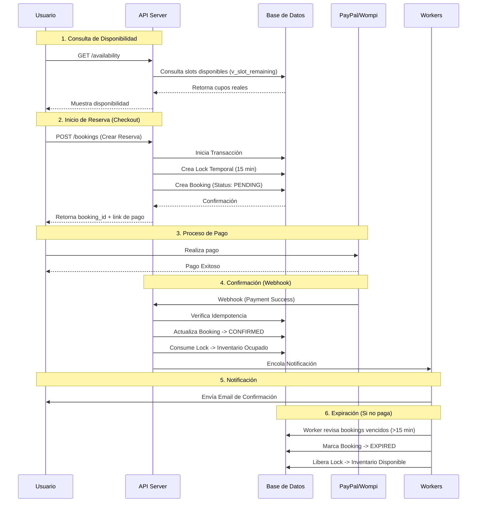

# 📘 Documentación del Flujo de Reservas - LIVEX

Esta documentación describe el flujo completo de una reserva en la plataforma LIVEX, desde la consulta de disponibilidad hasta la confirmación final y notificaciones.

---

## 🔄 Diagrama de Flujo General



---

## 📝 Detalle Paso a Paso

### 1. 📅 Consulta de Disponibilidad

El sistema calcula la disponibilidad en tiempo real para evitar sobreventa.

- **Endpoint**: `GET /api/v1/experiences/{id}/availability`
- **Lógica**: La disponibilidad se calcula usando una vista materializada (`v_slot_remaining`) que considera:
    1. Capacidad total del slot.
    2. Reservas confirmadas.
    3. Reservas pendientes (en proceso de pago).
    4. **Locks temporales** activos.

> **Formula**: `Disponibilidad = Capacidad Total - (Bookings Confirmados + Bookings Pendientes + Locks Activos)`

---

### 2. 🔒 Selección y Bloqueo (Anti-Sobreventa)

Cuando el usuario inicia el checkout, el sistema "aparta" los cupos temporalmente.

- **Acción**: El usuario envía los detalles de la reserva.
- **Endpoint**: `POST /api/v1/bookings`
- **Proceso Interno**:
    1. Se valida que haya cupos suficientes.
    2. Se crea un **Inventory Lock** con un TTL (Time To Live) de 15 minutos.
    3. Se crea el registro de **Booking** con estado `PENDING`.
- **Resultado**: Nadie más puede tomar esos cupos durante los próximos 15 minutos.

---

### 3. 💳 Procesamiento del Pago

El usuario es redirigido a la pasarela de pagos (PayPal o Wompi).

- **Estado**: El booking permanece en `PENDING`.
- **Expiración**: Si el usuario no completa el pago en 15 minutos, el `booking-expiry-worker` liberará los cupos automáticamente.

---

### 4. ✅ Confirmación de Reserva

Una vez el pago es exitoso, la pasarela notifica a nuestro backend.

- **Mecanismo**: Webhook o confirmación directa del cliente.
- **Proceso**:
    1. Se valida la firma del webhook (seguridad).
    2. Se busca el booking asociado.
    3. **Transacción Atómica**:
        - El estado del booking pasa a `CONFIRMED`.
        - El **Lock Temporal** se marca como `CONSUMED` (se convierte en ocupación permanente).
        - Se registra el pago en la tabla `payments`.

---

### 5. 🔔 Notificaciones

Una vez confirmada la reserva, el sistema notifica al usuario.

- **Worker**: `notification-worker`
- **Canal**: Email (vía Nodemailer)
- **Contenido**:
    - Detalles de la experiencia.
    - Código de reserva.
    - Información del punto de encuentro.
    - Resumen del pago.

---

## ⚙️ Workers y Procesos de Fondo

El sistema cuenta con procesos automáticos que garantizan la integridad de los datos:

| Worker | Función | Frecuencia |
|--------|---------|------------|
| **Booking Expiry** | Busca reservas `PENDING` que superaron los 15 min y las marca como `EXPIRED`, liberando los cupos. | Cada 30 seg |
| **Payment Reconciliation** | Verifica con la pasarela de pagos si hay transacciones que quedaron en estados inconsistentes y las corrige. | Diario (24h) |
| **Notification Worker** | Procesa la cola de emails para envío asíncrono, evitando bloquear el flujo principal. | Continuo |

---

## 🛠️ Estructura de Datos Clave

### Estados de una Reserva (`booking_status`)
1. **`pending`**: Reserva creada, cupos bloqueados temporalmente.
2. **`confirmed`**: Pago recibido, cupos asegurados.
3. **`expired`**: Tiempo de espera agotado, cupos liberados.
4. **`cancelled`**: Cancelada manualmente (con o sin reembolso).
5. **`completed`**: La experiencia ya ocurrió.

### Tabla `inventory_locks`
Es el corazón del sistema anti-sobreventa.
- `slot_id`: ID del horario.
- `quantity`: Cantidad de cupos bloqueados.
- `expires_at`: Cuándo se libera el bloqueo automáticamente.
- `consumed_at`: Cuándo se convirtió en una reserva real.

---

## 💰 Distribución de Pagos y Comisiones

El sistema calcula y registra automáticamente las comisiones de la plataforma una vez que el pago es confirmado.

### Lógica de Cálculo
Las comisiones se calculan en **Basis Points (BPS)** y los montos se manejan en **Cents** (centavos) para garantizar precisión matemática y evitar errores de redondeo (punto flotante).

- **Cents**: Unidad monetaria más pequeña (Ej: $10.00 USD = 1000 cents).
- **1 BPS** = 0.01%
- **100 BPS** = 1%
- **1000 BPS** = 10% (Valor por defecto)

### Flujo de Comisión
1. **Confirmación**: Al recibir el webhook de pago exitoso (`paid`).
2. **Cálculo**: Se toma el `total_cents` de la reserva y se aplica la tasa configurada.
   > Formula: `Comisión = (Total Cents * Tasa BPS) / 10000`
3. **Registro**: Se crea un registro en la tabla `commissions` vinculado al booking.

### Ejemplo
- **Reserva**: $100.00 USD (10,000 cents)
- **Tasa**: 1000 BPS (10%)
- **Comisión**: (10,000 * 1,000) / 10,000 = **1,000 cents ($10.00 USD)**
- **Neto para Proveedor**: $90.00 USD

### Configuración
La tasa se define en la variable de entorno:
```env
COMMISSION_RATE_BPS=1000 # 10%
```

---

## 🚨 Manejo de Errores y Casos Borde

- **Pago Fallido**: Si el pago falla, el usuario puede reintentar mientras el lock siga vivo (dentro de los 15 min). Si expira, debe iniciar de nuevo.
- **Concurrencia**: Si dos usuarios intentan reservar el último cupo al mismo milisegundo, la base de datos (PostgreSQL) garantiza que solo uno obtenga el lock; el otro recibirá un error de "Cupos insuficientes".
- **Webhooks Perdidos**: El worker de reconciliación detectará pagos exitosos en la pasarela que no tienen booking confirmado y corregirá el estado automáticamente.
