# 💰 Sistema de Reembolsos y Cancelaciones - LIVEX

## 📋 Índice
1. [Visión General](#visión-general)
2. [Flujos de Cancelación](#flujos-de-cancelación)
3. [API Endpoints](#api-endpoints)
4. [Implementación Técnica](#implementación-técnica)
5. [Casos de Uso](#casos-de-uso)
6. [Políticas de Reembolso](#políticas-de-reembolso)
7. [Testing](#testing)
8. [Troubleshooting](#troubleshooting)

---

## Visión General

El sistema de reembolsos de LIVEX maneja dos escenarios de cancelación:

| Escenario | Estado de Reserva | Requiere Reembolso | Endpoint |
|-----------|-------------------|-------------------|----------|
| **Cancelación Temprana** | `pending` | ❌ No | `PATCH /bookings/:id/cancel` |
| **Cancelación de Reserva Pagada** | `confirmed` | ✅ Sí | `POST /bookings/:id/cancel-confirmed` |

### Diferencias Clave

**Reserva Pending:**
- No se ha pagado aún
- Solo libera el `inventory_lock` temporalmente bloqueado
- No interactúa con el proveedor de pagos

**Reserva Confirmada:**
- Ya fue pagada (`payment.status = 'paid'`)
- Requiere procesar un reembolso con el proveedor (Wompi, PayPal)
- Libera el `inventory_lock` consumido y restaura `available_spots`
- Envía notificación de reembolso al cliente

---

## Flujos de Cancelación

### Flujo 1: Cancelar Reserva Pending

```mermaid
graph TD
    A[Cliente solicita cancelación] --> B[PATCH /bookings/:id/cancel]
    B --> C{Booking status = pending?}
    C -->|No| D[Error: Cannot cancel]
    C -->|Sí| E[Actualizar booking.status = cancelled]
    E --> F[Liberar inventory_lock]
    F --> G[Restaurar available_spots]
    G --> H[✅ Cancelación exitosa]
```



**Código:**
```bash
curl -X PATCH http://localhost:3000/api/v1/bookings/{booking_id}/cancel \
  -H "Authorization: Bearer {TOKEN}" \
  -H "Content-Type: application/json" \
  -d '{
    "reason": "Cambio de planes"
  }'
```

---

### Flujo 2: Cancelar Reserva Confirmada (Con Reembolso)

```mermaid
graph TD
    A[Cliente solicita cancelación] --> B[POST /bookings/:id/cancel-confirmed]
    B --> C{Booking status = confirmed?}
    C -->|No| D[Error: Invalid status]
    C -->|Sí| E[Actualizar booking.status = cancelled]
    E --> F[Liberar inventory_lock]
    F --> G[Restaurar available_spots]
    G --> H[Buscar payment asociado]
    H --> I{Payment encontrado?}
    I -->|No| J[Error: No payment found]
    I -->|Sí| K[Llamar PaymentsService.processBookingCancellationRefund]
    K --> L[Crear refund con proveedor]
    L --> M{Refund exitoso?}
    M -->|Sí| N[Guardar refund en DB status=processed]
    M -->|No| O[Guardar refund en DB status=failed]
    N --> P[Enviar email de reembolso]
    O --> Q[Notificar error al cliente]
    P --> R[✅ Cancelación con reembolso]
    Q --> S[⚠️ Cancelación sin reembolso]
```



**Código:**
```bash
curl -X POST http://localhost:3000/api/v1/bookings/{booking_id}/cancel-confirmed \
  -H "Authorization: Bearer {TOKEN}" \
  -H "Content-Type: application/json" \
  -d '{
    "reason": "Emergencia familiar"
  }'
```

**Respuesta Exitosa:**
```json
{
  "message": "Booking cancelled successfully. Refund will be processed.",
  "refund": {
    "id": "3fa85f64-5717-4562-b3fc-2c963f66afa6",
    "amount": 15000000,
    "status": "processed"
  }
}
```

**Respuesta con Error de Reembolso:**
```json
{
  "message": "Booking cancelled successfully. Refund will be processed.",
  "refund": {
    "status": "failed",
    "error": "Refund processing failed. Please contact support."
  }
}
```

---

## API Endpoints

### 1. Cancelar Reserva Pending

**Endpoint:** `PATCH /api/v1/bookings/:bookingId/cancel`

**Autenticación:** ✅ Requerida (JWT)

**Request Body:**
```typescript
{
  reason?: string;  // Opcional, máx 500 caracteres
}
```

**Responses:**

| Código | Descripción |
|--------|-------------|
| 204 | Cancelación exitosa (No Content) |
| 400 | Reserva no está en estado `pending` |
| 401 | No autenticado |
| 404 | Reserva no encontrada |

---

### 2. Cancelar Reserva Confirmada (Con Reembolso)

**Endpoint:** `POST /api/v1/bookings/:bookingId/cancel-confirmed`

**Autenticación:** ✅ Requerida (JWT)

**Request Body:**
```typescript
{
  reason?: string;  // Opcional, máx 500 caracteres
}
```

**Responses:**

| Código | Descripción |
|--------|-------------|
| 200 | Cancelación y reembolso exitosos |
| 400 | Reserva no está en estado `confirmed` o no hay pago |
| 401 | No autenticado |
| 404 | Reserva no encontrada |
| 409 | Reembolso ya existe para esta reserva |

**Response Body:**
```typescript
{
  message: string;
  refund: {
    id?: string;
    amount?: number;
    status: 'processed' | 'failed';
    error?: string;
  };
}
```

---

## Implementación Técnica

### Arquitectura

```
┌─────────────────────────────────────────────────┐
│        BookingsController                       │
│  POST /bookings/:id/cancel-confirmed            │
└────────────────┬────────────────────────────────┘
                 │
                 ├─────────────────┬──────────────┐
                 ▼                 ▼              ▼
┌─────────────────────┐  ┌──────────────┐  ┌──────────────┐
│ BookingsService     │  │PaymentsService│  │Notification  │
│ .cancelConfirmed()  │  │.processRefund()│  │Service       │
└─────────────────────┘  └──────────────┘  └──────────────┘
         │                      │                   │
         ▼                      ▼                   ▼
┌─────────────────┐  ┌──────────────────┐  ┌──────────────┐
│ Database        │  │ Wompi/PayPal     │  │ Email/SMS    │
│ (Transactions)  │  │ Provider API     │  │              │
└─────────────────┘  └──────────────────┘  └──────────────┘
```

### Cambios en Base de Datos

El sistema actualiza múltiples tablas en una transacción:

```sql
-- 1. Actualizar estado de la reserva
UPDATE bookings 
SET status = 'cancelled', updated_at = NOW()
WHERE id = $bookingId;

-- 2. Liberar el inventory lock
UPDATE inventory_locks 
SET consumed_at = NULL, released_at = NOW()
WHERE booking_id = $bookingId;

-- 3. Restaurar disponibilidad
UPDATE availability_slots 
SET available_spots = available_spots + (
  SELECT quantity FROM inventory_locks WHERE booking_id = $bookingId
)
WHERE id = (SELECT slot_id FROM bookings WHERE id = $bookingId);

-- 4. Crear el refund
INSERT INTO refunds (
  id, payment_id, amount_cents, currency, status, reason,
  provider_refund_id, created_at, processed_at, updated_at
) VALUES (...);
```

### Flujo de Reembolso

#### Método: `PaymentsService.processBookingCancellationRefund()`

**Paso 1:** Buscar el pago asociado
```typescript
const payment = await client.query(
  `SELECT * FROM payments WHERE booking_id = $1 AND status = 'paid'`,
  [bookingId]
);
```

**Paso 2:** Verificar que no exista un refund previo
```typescript
const existingRefund = await client.query(
  `SELECT * FROM refunds WHERE payment_id = $1`,
  [payment.id]
);

if (existingRefund.rows.length > 0) {
  throw new ConflictException('Refund already exists');
}
```

**Paso 3:** Llamar al proveedor de pagos
```typescript
const provider = this.paymentProviderFactory.getProvider(payment.provider);

const refundResult = await provider.createRefund({
  paymentId: payment.provider_payment_id,
  amount: payment.amount_cents,
  reason: 'Booking cancelled by customer',
});
```

**Paso 4:** Guardar el refund en la base de datos
```typescript
await client.query(
  `INSERT INTO refunds (id, payment_id, amount_cents, status, ...)
   VALUES ($1, $2, $3, 'processed', ...)`,
  [refundId, payment.id, payment.amount_cents]
);
```

**Paso 5:** Enviar notificación
```typescript
this.notificationService.sendRefundProcessed(user.email, {
  customerName: user.full_name,
  refundAmount: Number((amount / 100).toFixed(2)),
  bookingCode: bookingId.substring(0, 8).toUpperCase(),
});
```

---

## Casos de Uso

### Caso 1: Cliente Cambia de Planes (Reserva Pending)

**Escenario:**
- Juan crea una reserva pero aún no paga
- Decide cancelar porque cambió de destino

**Flujo:**
1. Juan llama a `PATCH /bookings/{id}/cancel`
2. Sistema marca la reserva como `cancelled`
3. Libera el cupo reservado
4. ✅ No se cobra ni reembolsa nada

---

### Caso 2: Emergencia Médica (Reserva Pagada)

**Escenario:**
- María pagó $150,000 COP por un tour
- Tiene una emergencia y debe cancelar

**Flujo:**
1. María llama a `POST /bookings/{id}/cancel-confirmed`
2. Sistema cancela la reserva
3. Sistema procesa reembolso con Wompi
4. Wompi devuelve $150,000 COP a la tarjeta
5. ✅ María recibe email confirmando el reembolso

---

### Caso 3: Falla del Proveedor de Pagos

**Escenario:**
- Pedro cancela su reserva
- La API de Wompi está caída

**Flujo:**
1. Pedro llama a `POST /bookings/{id}/cancel-confirmed`
2. Sistema cancela la reserva ✅
3. Intenta procesar reembolso con Wompi ❌
4. Sistema guarda `refund.status = 'failed'`
5. ⚠️ Pedro recibe respuesta indicando que debe contactar soporte
6. El equipo de LIVEX procesa el reembolso manualmente

---

## Políticas de Reembolso

### Tiempos de Procesamiento

| Proveedor | Tiempo de Reembolso | Notas |
|-----------|-------------------|-------|
| **Wompi** | 3-5 días hábiles | Tarjetas de crédito/débito |
| **PayPal** | 1-3 días hábiles | Cuenta PayPal |
| **Manual** | 7-10 días hábiles | Procesado por LIVEX |

### Cuándo NO se Permite Cancelación

- ❌ Reserva ya está en estado `cancelled`
- ❌ Reserva ya fue usada (pasó la fecha de la experiencia)
- ❌ Reserva está en proceso de cancelación
- ❌ Ya existe un reembolso procesado

### Reembolsos Parciales

**⚠️ No Implementado Actualmente**

En el futuro, el sistema permitirá:
- Cancelar solo algunos participantes (ej: 2 de 4 personas)
- Aplicar penalizaciones según política (ej: 10% si cancela con <24h)

**Propuesta de API:**
```bash
POST /bookings/{id}/cancel-confirmed
{
  "reason": "Solo 2 personas pueden asistir",
  "partialRefund": {
    "adults": 2,  // De 4 originales
    "applyPenalty": true,
    "penaltyPercentage": 10
  }
}
```

---

## Testing

### Test Manual con CURL

#### 1. Crear una reserva
```bash
BOOKING_ID=$(curl -X POST http://localhost:3000/api/v1/bookings \
  -H "Authorization: Bearer $TOKEN" \
  -H "Content-Type: application/json" \
  -d '{
    "slotId": "...",
    "experienceId": "...",
    "adults": 2,
    "subtotalCents": 10000000,
    "taxCents": 1900000,
    "currency": "COP"
  }' | jq -r '.bookingId')

echo "Booking ID: $BOOKING_ID"
```

#### 2. Pagar la reserva
```bash
PAYMENT_ID=$(curl -X POST http://localhost:3000/api/v1/payments \
  -H "Authorization: Bearer $TOKEN" \
  -H "Content-Type: application/json" \
  -d '{
    "bookingId": "'$BOOKING_ID'",
    "provider": "wompi"
  }' | jq -r '.id')

# Simular webhook de pago exitoso (solo desarrollo)
curl -X POST http://localhost:3000/api/v1/payments/webhooks/wompi \
  -H "Content-Type: application/json" \
  -d '{
    "event": "transaction.updated",
    "data": {
      "id": "'$PAYMENT_ID'",
      "status": "APPROVED",
      "reference": "'$BOOKING_ID'"
    }
  }'
```

#### 3. Cancelar y solicitar reembolso
```bash
curl -X POST http://localhost:3000/api/v1/bookings/$BOOKING_ID/cancel-confirmed \
  -H "Authorization: Bearer $TOKEN" \
  -H "Content-Type: application/json" \
  -d '{
    "reason": "Test de cancelación"
  }'
```

#### 4. Verificar el reembolso en la base de datos
```sql
SELECT * FROM refunds 
WHERE payment_id = (
  SELECT id FROM payments WHERE booking_id = '{booking_id}'
);
```

---

## Troubleshooting

### ❌ Error: "Cannot cancel booking in status: pending"

**Causa:** Intentas usar `cancel-confirmed` en una reserva no pagada.

**Solución:** Usar `PATCH /bookings/:id/cancel` para reservas pending.

---

### ❌ Error: "No payment found for this booking"

**Causa:** La reserva está confirmada pero no tiene un pago asociado (inconsistencia de datos).

**Solución:**
```sql
-- Verificar el estado de la reserva
SELECT b.status, p.status 
FROM bookings b
LEFT JOIN payments p ON p.booking_id = b.id
WHERE b.id = '{booking_id}';

-- Si no hay pago, cambiar a pending manualmente
UPDATE bookings SET status = 'pending' WHERE id = '{booking_id}';
```

---

### ❌ Error: "Refund already exists for this payment"

**Causa:** Ya se procesó un reembolso anteriormente (evita doble reembolso).

**Solución:** Verificar el estado del refund existente:
```sql
SELECT * FROM refunds WHERE payment_id = '{payment_id}';
```

Si el estado es `failed`, se puede reintentarlo manualmente desde admin.

---

### ⚠️ El reembolso falla pero la reserva se cancela

**Comportamiento Esperado:** La cancelación es exitosa, pero el reembolso queda pendiente.

**Acción del Usuario:** Contactar soporte con el `bookingId`.

**Acción de LIVEX:**
1. Verificar logs del proveedor de pagos
2. Procesar reembolso manualmente si es necesario
3. Actualizar `refund.status` a `'processed'`

---

## Mejores Prácticas

### ✅ DO

1. **Siempre usar transacciones** para garantizar consistencia
2. **Loguear todos los intentos** de cancelación/reembolso
3. **Notificar al cliente** sobre el estado del reembolso
4. **Manejar fallos gracefully** (cancelar aunque el refund falle)
5. **Permitir reintento manual

** desde admin

### ❌ DON'T

1. **No cancelar** si ya existe un refund procesado
2. **No restaurar inventario** sin verificar el lock
3. **No asumir** que el proveedor de pagos siempre funciona
4. **No bloquear** la cancelación si el refund falla
5. **No exponer** detalles del proveedor al cliente

---

## Roadmap Futuro

### 🔄 En Progreso
- [ ] Políticas de cancelación configurables por resort
- [ ] Reembolsos parciales (solo algunos participantes)

### 📅 Planificado
- [ ] Penalizaciones por cancelación tardía
- [ ] Dashboard de reembolsos para admin
- [ ] Webhooks para notificar al resort de cancelaciones
- [ ] Reintento automático de reembolsos fallidos

### 💡 Ideas
- [ ] Crédito en lugar de reembolso (voucher)
- [ ] Cambio de fecha en lugar de cancelación
- [ ] Transferencia de reserva a otro usuario

---

##  Referencias

- **BookingsService:** `src/bookings/bookings.service.ts`
  - Método: `cancelConfirmedBooking()`
- **BookingsController:** `src/bookings/bookings.controller.ts`
  - Endpoint: `POST /:id/cancel-confirmed`
- **PaymentsService:** `src/payments/payments.service.ts`
  - Método: `processBookingCancellationRefund()`
- **NotificationService:** `src/notifications/services/notification.service.ts`
  - Método: `sendRefundProcessed()`

---

**Versión:** 1.0  
**Última actualización:** 2025-11-26  
**Estado:** ✅ Producción-Ready
