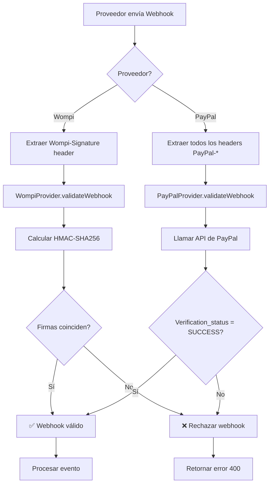

# 🔒 Seguridad de Webhooks - LIVEX

## 📋 Índice
1. [Visión General](#visión-general)
2. [Implementación por Proveedor](#implementación-por-proveedor)
3. [Configuración](#configuración)
4. [Flujo de Validación](#flujo-de-validación)
5. [Testing](#testing)
6. [Troubleshooting](#troubleshooting)
7. [Mejores Prácticas](#mejores-prácticas)

---

## Visión General

Los **webhooks** son llamadas HTTP que los proveedores de pago (Wompi, PayPal) hacen a nuestro backend para notificar eventos como pagos exitosos, fallos o reembolsos.

### ⚠️ El Problema de Seguridad

Sin validación de firma, **cualquiera** podría enviar una petición falsa a nuestro endpoint de webhooks:

```bash
# ⚠️ Ataque simulando un pago exitoso
curl -X POST http://api.livex.com/payments/webhooks/wompi \
  -H "Content-Type: application/json" \
  -d '{
    "event": "transaction.updated",
    "data": {
      "status": "APPROVED",
      "reference": "booking-123"
    }
  }'
```

**Consecuencia:** El sistema marcaría la reserva como pagada sin haber recibido dinero real.

### ✅ La Solución: Firma Criptográfica

Cada proveedor firma los webhooks con un **secreto compartido**. Nosotros validamos esa firma antes de procesar el evento.

| Proveedor | Método de Firma | Algoritmo |
|-----------|----------------|-----------|
| **Wompi** | HMAC-SHA256 sobre JSON | `crypto.createHmac('sha256', secret)` |
| **PayPal** | API de Verificación | `POST /v1/notifications/verify-webhook-signature` |

---

## Implementación por Proveedor

### 1. Wompi (HMAC-SHA256)

#### Cómo Funciona

Wompi calcula un hash del payload usando HMAC-SHA256 y el secret compartido, luego envía ese hash en el header `Wompi-Signature`.

#### Implementación

```typescript
// src/payments/providers/wompi.provider.ts

private async validateWebhookSignature(payload: any, signature: string): Promise<boolean> {
  if (!this.config.webhookSecret) {
    this.logger.warn('WOMPI_WEBHOOK_SECRET not configured');
    return true; // ⚠️ Solo en desarrollo
  }

  try {
    const crypto = await import('crypto');
    
    // Stringificar el payload exactamente como lo envió Wompi
    const payloadString = JSON.stringify(payload);
    
    // Calcular HMAC-SHA256
    const hmac = crypto.createHmac('sha256', this.config.webhookSecret);
    hmac.update(payloadString);
    const calculatedSignature = hmac.digest('hex');
    
    // Comparación constant-time (previene timing attacks)
    const isValid = crypto.timingSafeEqual(
      Buffer.from(signature),
      Buffer.from(calculatedSignature)
    );

    if (!isValid) {
      this.logger.error('Wompi webhook signature validation failed');
    }

    return isValid;
  } catch (error) {
    this.logger.error('Error validating Wompi webhook signature', error);
    return false;
  }
}
```

#### Headers Enviados por Wompi

```
POST /v1/payments/webhooks/wompi
Content-Type: application/json
Wompi-Signature: a1b2c3d4e5f6...
```

---

### 2. PayPal (API de Verificación)

#### Cómo Funciona

PayPal no usa un secret simple. En su lugar:
1. Envía múltiples headers con información de la firma
2. Nosotros llamamos a su API de verificación
3. PayPal valida y responde `SUCCESS` o `FAILURE`

#### Implementación

```typescript
// src/payments/providers/paypal.provider.ts

private async validateWebhookSignature(payload: any, headers: any): Promise<boolean> {
  if (!this.config.webhookId) {
    this.logger.warn('PAYPAL_WEBHOOK_ID not configured');
    return true; // ⚠️ Solo en desarrollo
  }

  try {
    await this.ensureAccessToken();

    const verificationData = {
      auth_algo: headers['paypal-auth-algo'],
      cert_url: headers['paypal-cert-url'],
      transmission_id: headers['paypal-transmission-id'],
      transmission_sig: headers['paypal-transmission-sig'],
      transmission_time: headers['paypal-transmission-time'],
      webhook_id: this.config.webhookId,
      webhook_event: payload,
    };

    // Validar que todos los headers estén presentes
    if (!verificationData.auth_algo || !verificationData.cert_url) {
      this.logger.error('Missing required PayPal webhook headers');
      return false;
    }

    // Llamar a la API de verificación de PayPal
    const response = await fetch(
      `${this.config.baseUrl}/v1/notifications/verify-webhook-signature`,
      {
        method: 'POST',
        headers: {
          'Content-Type': 'application/json',
          'Authorization': `Bearer ${this.accessToken}`,
        },
        body: JSON.stringify(verificationData),
      }
    );

    const result = await response.json();
    
    const isValid = result.verification_status === 'SUCCESS';

    if (!isValid) {
      this.logger.error('PayPal webhook verification failed');
    }

    return isValid;

  } catch (error) {
    this.logger.error('Error validating PayPal webhook signature', error);
    return false;
  }
}
```

#### Headers Enviados por PayPal

```
POST /v1/payments/webhooks/paypal
Content-Type: application/json
PayPal-Auth-Algo: SHA256withRSA
PayPal-Cert-Url: https://api.paypal.com/v1/notifications/certs/...
PayPal-Transmission-Id: 1234abcd-...
PayPal-Transmission-Sig: aBc123...
PayPal-Transmission-Time: 2025-11-26T20:00:00Z
```

---

## Configuración

### Variables de Entorno

Agregar a `.env`:

```bash
# Wompi
WOMPI_PUBLIC_KEY=pub_test_xxxxxxxxxx
WOMPI_PRIVATE_KEY=prv_test_xxxxxxxxxx
WOMPI_WEBHOOK_SECRET=your-webhook-secret-here  # ⭐ Nuevo

# PayPal
PAYPAL_CLIENT_ID=your-client-id
PAYPAL_CLIENT_SECRET=your-client-secret
PAYPAL_WEBHOOK_ID=your-webhook-id-here  # ⭐ Nuevo
```

### Cómo Obtener los Secretos

#### Wompi

1. Iniciar sesión en [dashboard.wompi.co](https://dashboard.wompi.co)
2. Ir a **Integraciones → Webhooks**
3. Crear un nuevo webhook:
   - URL: `https://api.livex.com/v1/payments/webhooks/wompi`
   - Eventos: `transaction.updated`
4. **Copiar el secret generado** y guardarlo en `WOMPI_WEBHOOK_SECRET`

#### PayPal

1. Iniciar sesión en [developer.paypal.com](https://developer.paypal.com)
2. Ir a **My Apps & Credentials → Your App → Webhooks**
3. Click en **Add Webhook**:
   - URL: `https://api.livex.com/v1/payments/webhooks/paypal`
   - Eventos: `PAYMENT.CAPTURE.COMPLETED`, `PAYMENT.CAPTURE.DENIED`
4. **Copiar el Webhook ID** mostrado y guardarlo en `PAYPAL_WEBHOOK_ID`

---

## Flujo de Validación

### Diagrama Completo



### Código del Controller

```typescript
// src/payments/payments.controller.ts

@Post('webhooks/:provider')
@HttpCode(HttpStatus.OK)
async processWebhook(
  @Param('provider') provider: string,
  @Body() payload: any,
  @Headers() headers: Record<string, string>,
) {
  const signature = headers['x-signature'] || headers['wompi-signature'];

  const webhookPayload: WebhookPayloadDto = {
    provider,
    payload,
    signature,
    headers, // Necesario para PayPal
  };

  await this.paymentsService.processWebhook(webhookPayload);
  return { success: true };
}
```

### Código del Service

```typescript
// src/payments/payments.service.ts

async processWebhook(dto: WebhookPayloadDto): Promise<void> {
  const provider = this.paymentProviderFactory.getProvider(dto.provider);
  
  // Para PayPal, pasar headers; para Wompi, pasar signature
  const validationData = dto.provider === 'paypal' ? dto.headers : dto.signature;
  
  // ⭐ Validación de firma antes de procesar
  const webhookEvent = await provider.validateWebhook(dto.payload, validationData);
  
  // Solo si la validación pasó, procesar el evento
  if (webhookEvent.status === 'paid') {
    await this.confirmBookingPayment(client, bookingId);
  }
}
```

---

## Testing

### Test en Desarrollo (Sin Secret)

Si no configuras los secrets, el sistema permite los webhooks con un warning:

```
[WompiProvider] WARN: WOMPI_WEBHOOK_SECRET not configured. Skipping signature validation.
```

**⚠️ Esto es seguro solo en desarrollo.**

### Test con Wompi

```bash
# 1. Calcular la firma manualmente
PAYLOAD='{"event":"transaction.updated","data":{"status":"APPROVED","reference":"test-123"}}'
SECRET="your_webhook_secret"

SIGNATURE=$(echo -n "$PAYLOAD" | openssl dgst -sha256 -hmac "$SECRET" | awk '{print $2}')

# 2. Enviar webhook con firma
curl -X POST http://localhost:3000/v1/payments/webhooks/wompi \
  -H "Content-Type: application/json" \
  -H "Wompi-Signature: $SIGNATURE" \
  -d "$PAYLOAD"
```

### Test con PayPal

PayPal no permite simular webhooks fácilmente. Opciones:

1. **Usar PayPal Sandbox:**
   - Hacer un pago de prueba en sandbox
   - PayPal enviará webhooks reales a tu URL
   
2. **Deshabilitar validación temporalmente:**
   ```typescript
   if (process.env.NODE_ENV === 'development') {
     return true; // Skip validation
   }
   ```

3. **Usar ngrok para exponer localhost:**
   ```bash
   ngrok http 3000
   # Configurar la URL de ngrok en PayPal dashboard
   ```

---

## Troubleshooting

### ❌ Error: "Invalid webhook signature"

**Causa Wompi:** El secret es incorrecto o el payload no coincide.

**Solución:**
1. Verificar que `WOMPI_WEBHOOK_SECRET` sea el correcto del dashboard
2. Revisar logs para comparar firmas:
   ```
   [WompiProvider] Received: a1b2c3...
   [WompiProvider] Calculated: d4e5f6...
   ```
3. Asegurar que el payload JSON no fue modificado en el camino

**Causa PayPal:** Headers faltantes o webhook ID incorrecto.

**Solución:**
1. Verificar que todos los headers `PayPal-*` estén presentes
2. Confirmar que `PAYPAL_WEBHOOK_ID` coincide con el del dashboard

---

### ❌ Webhook no llega al servidor

**Problema:** El proveedor no puede alcanzar tu endpoint.

**Solución:**
1. Si estás en local, usar **ngrok** o **localtunnel**:
   ```bash
   ngrok http 3000
   # URL pública: https://abc123.ngrok.io
   ```
2. Configurar esa URL en el dashboard del proveedor
3. Revisar logs del proveedor (algunos muestran intentos fallidos)

---

### ⚠️ Firmas válidas pero eventos duplicados

**Problema:** El proveedor reintenta el webhook si no recibe 200 OK rápido.

**Solución:**
1. Asegurar que el endpoint siempre retorna 200:
   ```typescript
   return { success: false, error: error.message }; // ⭐ 200 OK
   ```
2. Implementar idempotencia en `webhook_events` table (ya implementado):
   ```sql
   CREATE UNIQUE INDEX idx_webhook_events_provider_id 
   ON webhook_events(provider, payload->'id');
   ```

---

## Mejores Prácticas

### ✅ DO

1. **Siempre validar en producción:**
   ```typescript
   if (process.env.NODE_ENV === 'production' && !secret) {
     throw new Error('Webhook secret must be configured in production');
   }
   ```

2. **Usar comparación constant-time:**
   ```typescript
   crypto.timeSafeEqual(Buffer.from(a), Buffer.from(b));
   // ✅ Previene timing attacks
   ```

3. **Loguear intentos fallidos:**
   ```typescript
   this.logger.error('Invalid webhook signature', {
     provider,
     receivedSignature: signature.substring(0, 10) + '...',
   });
   ```

4. **Retornar 200 siempre:**
   ```typescript
   // ✅ Evita reintentos infinitos
   return { success: false };
   ```

5. **Verificar eventos duplicados:**
   ```sql
   SELECT * FROM webhook_events WHERE id = $1;
   ```

### ❌ DON'T

1. **No loguear el secret completo:**
   ```typescript
   this.logger.debug('Secret:', this.config.webhookSecret); // ❌
   ```

2. **No deshabilitar validación en producción:**
   ```typescript
   if (!signature) return true; // ❌ Peligroso
   ```

3. **No asumir formato del payload:**
   ```typescript
   const id = payload.data.id; // ❌ Puede ser undefined
   const id = payload?.data?.id ?? null; // ✅
   ```

4. **No bloquear el webhook con operaciones lentas:**
   ```typescript
   // ❌ Mal: esperar 30s
   await sendEmailToUser(...);
   return { success: true };
   
   // ✅ Bien: procesar async
   this.emailQueue.add({ ... });
   return { success: true };
   ```

---

## Seguridad Adicional

### 1. Rate Limiting

Limitar webhooks por IP para prevenir ataques DDoS:

```typescript
@Throttle({ default: { limit: 100, ttl: 60000 } }) // 100/min
@Post('webhooks/:provider')
async processWebhook(...) { }
```

### 2. IP Whitelisting

Solo aceptar webhooks de IPs conocidas:

```typescript
const allowedIPs = {
  wompi: ['192.168.1.1', '10.0.0.1'],
  paypal: ['173.0.82.0/24', '64.4.240.0/24'],
};

if (!allowedIPs[provider].includes(req.ip)) {
  throw new ForbiddenException('IP not allowed');
}
```

### 3. HTTPS Obligatorio

En producción, rechazar webhooks HTTP:

```typescript
if (process.env.NODE_ENV === 'production' && req.protocol !== 'https') {
  throw new BadRequestException('Webhooks must use HTTPS');
}
```

---

## Referencias

### Documentación Oficial

- **Wompi Webhooks:** [https://docs.wompi.co/webhooks](https://docs.wompi.co/webhooks)
- **PayPal Webhooks:** [https://developer.paypal.com/api/rest/webhooks/](https://developer.paypal.com/api/rest/webhooks/)

### Implementación LIVEX

- **WompiProvider:** `src/payments/providers/wompi.provider.ts`
- **PayPalProvider:** `src/payments/providers/paypal.provider.ts`
- **PaymentsController:** `src/payments/payments.controller.ts`
- **PaymentsService:** `src/payments/payments.service.ts`

---

**Versión:** 1.0  
**Última actualización:** 2025-11-26  
**Estado:** ✅ Producción-Ready  
**Seguridad:** 🔒 HMAC-SHA256 + API Verification
